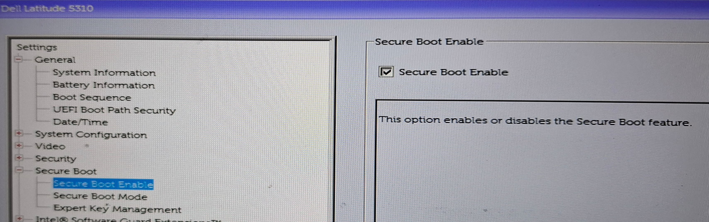
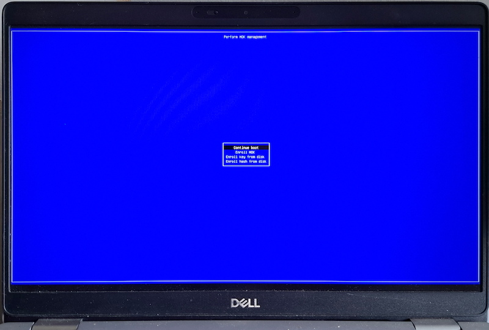

I've [already written on my other blog](https://random.too-many-machines.com/posts/secure-boot-broken/) about what Secure Boot is and why I don't trust it much. The short version is that it's a chain of trust with too many links. Still, I enable it anyway. Imperfect security is better than none, and it's a low-effort checkbox.

You might need to go into your UEFI/BIOS settings and turn it on there. Some motherboards ship with it off by default. Check `mokutil --sb-state` to see if it is enabled.



## Kernel module signing

If Secure Boot is on, the kernel will refuse to load any module that isn't signed by a key it trusts. Distro kernel and modules are already signed by the distro. But if you have DKMS-built drivers (e.g. NVIDIA or VirtualBox), the system will boot, but the modules won't be loaded.

You need to sign the modules with your own key. The process is a bit awkward:

- first, you run a few commands to generate a signing key and a certificate
- then you reconfigure MOK, at this step you need to provide a one-time password
- at the next boot, MokManager will run **before** GRUB - you'll have a few seconds to press any key, otherwise it will proceed with a normal boot
- in MokManager, you need to enter the one-time password
- from now on, the modules will be signed and you won't need the password anymore

Since I do it with all my Linux computers, I use a playbook for that. Tested with Debian Forky, should work on any recent Debian or Ubuntu.

```yaml
---
- name: Install MOK signing prerequisites
  ansible.builtin.apt:
    name:
      - dkms
      - mokutil
      - openssl
      - python3-pexpect
    state: latest

- name: Ensure the DKMS tree directory exists
  ansible.builtin.file:
    path: /var/lib/dkms
    state: directory
    mode: '0755'

- name: Generate DKMS module signing key and certificate
  ansible.builtin.command:
    cmd: >-
      openssl req -new -x509 -nodes -days 36500 -subj "/CN=DKMS module signing key"
      -newkey rsa:2048 -keyout {{ mok_signing_key }}
      -addext "extendedKeyUsage=codeSigning"
      -outform DER -out {{ mok_signing_cert }}
  args:
    creates: "{{ mok_signing_key }}"

- name: Restrict permissions on the MOK private key
  ansible.builtin.file:
    path: "{{ mok_signing_key }}"
    mode: '0600'

- name: Check whether the MOK certificate is already enrolled
  ansible.builtin.command: "mokutil --test-key {{ mok_signing_cert }}"
  register: mok_enrollment_check
  changed_when: false

- name: Stage MOK certificate for enrollment
  ansible.builtin.expect:
    command: "mokutil --import {{ mok_signing_cert }}"
    responses:
      "[Ii]nput password:": "{{ mok_signing_passphrase }}"
      "[Ii]nput password again:": "{{ mok_signing_passphrase }}"
  when: "'is not enrolled' in mok_enrollment_check.stdout"
  no_log: true
```

Walking through what it does:

1. Installs the required utils.
2. Makes sure the path /var/lib/dkms where DKMS keeps keys and modules exists and has correct permissions.
3. Generates a self-signed X.509 certificate, marked for code signing, with the matching private key. The *creates* argument makes this idempotent - if the key already exists, it won't be regenerated.
4. Checks with `mokutil --test-key` whether the certificate is already enrolled.
6. If it isn't, stages it for enrolment with `mokutil --import`. This is the one interactive-feeling step: `mokutil --import` asks you to set a password, which the playbook answers via `ansible.builtin.expect`. That way I can keep it in Ansible Vault.

After the playbook runs, you have to reboot and go through that MokManager prompt manually - "Enroll MOK" -> select the certificate -> enter the password -> confirm. There's no way around that step, it's a deliberate physical-presence check so malware can't silently enrol its own keys.



## I don't have 3rd party modules or I'm not sure

You can go through these steps anyway. They won't break anything and you'll be ready if you add DKMS drivers in future.
