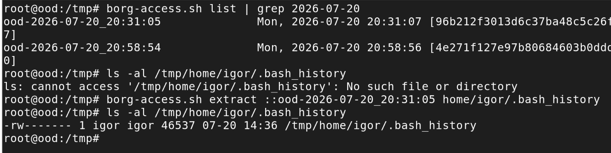

In [part 1](/home/backup-choices/), I reviewed several backup solutions and hated most of them. Borg seemed to be the least repulsive; I ended up almost liking it.

## Installing and configuring with Ansible

Two Ansible roles: *borg_client* is applied to every host that needs backing up. Firefly, which is both the client and the target, only backs up /etc. My laptop backs up /etc and my home dir, with some exclusions. The role also delegates some tasks to the Borg server - mainly, creating a dedicated user account (one per each client) and the directory. Since Borg writes lots of small files, and btrfs's copy-on-write fragments badly under that pattern, the repository directory gets `chattr +C` applied before any repo is created in it. Which means btrfs will not do checksumming for that directory, but Borg already does chunk-level integrity checking.

Second role *borg_server*, applied only to firefly, doesn't actually install the server - there's no separate client and server app, the same binary does both. Instead, it configures retention (deleting old archives) and compacting the repositories.

### Locking down the server side

Each client gets its own dedicated SSH key and its own dedicated Unix account on firefly. The account's authorized_keys entry is what actually enforces append-only:

```bash
command="borg serve --restrict-to-path /data/noshare/borg/<client> --append-only",restrict
```

*--restrict-to-path* confines that key to its own client's repository and nothing else on the box; *restrict* (modern OpenSSH shorthand) turns off port/agent/X11 forwarding and PTY allocation. The account's shell is */bin/sh*, not *nologin* - that one tripped me up, since *nologin* seemed like the more locked-down choice, but sshd runs the forced *command=* through the account's configured shell, and nologin refuses to run anything at all, forced command included.

### Passphrases without leaving a trace

Passphrases live in Ansible Vault and get written once to a file readable only by root, then handed to the backup service via systemd's *LoadCredential=*, which copies them into a private, auto-cleaned runtime directory for just that one run. The script reads it with:

```bash
BORG_PASSCOMMAND="cat ${CREDENTIALS_DIRECTORY}/borg-passphrase"
```

instead of setting *BORG_PASSPHRASE* directly - Borg runs that command whenever it needs the passphrase, so the value never sits in the process environment (readable via `/proc/<pid>/environ`) or in the deployed script itself.

### Coping with a laptop that isn't always on

My laptop travels with me, so it often ends up on another network than my NAS. Rather than let every missed connection be treated as a failed backup, the script sets a short connect timeout and inspects what Borg's output actually says before deciding whether to fail:

```bash
BORG_RSH="ssh -o ConnectTimeout=10 -o BatchMode=yes ..."
```

Timeout, refused, unreachable, DNS failure - logged and treated as "nothing to do this run" (exit 0). Anything else - a real auth failure, a full disk, repo corruption - still exits non-zero.

Everything is scheduled through systemd timers rather than cron, mainly for `Persistent=true` - a laptop that's asleep at 2am simply runs its backup on next wake instead of silently skipping it.

The end result: every night, each machine pushes an encrypted, deduplicated, tamper-resistant backup to firefly, and I don't have to think about it again until I actually need a restore.

## What I didn't like

- My perfect backup software would have both a full-featured CLI and a GUI. I want CLI for scripting, but GUI would be better for less-used operations, such as "find and compare several past versions of this file to see which one I need". There are 3rd party GUIs, I might try one some day.
- Some server-side configuration is done by the client role. I couldn't find any other sane way.
- I have to keep passwords in plain text in one file on the server (readable only by root, but still). That is a tough choice. I want per-client encryption, but also the scripts running on the server need a way to access the repository for pruning and compacting, so they need to have access to the encryption key (since the clients use append-only mode, they can't handle that, it has to be done server-side).

## What I liked

- Borg plays well with the way I already use my Linux machines: it uses SSH, it's scriptable, doesn't need a GUI, it can be easily configured with Ansible. I expected that since every client needs a separate user account, SSH keypair and cron/systemd jobs, adding another machine would be a long process. I admit I spent an hour or two writing the playbook. But after that, it's now dead simple: just add borg_client role to the new client's playbook, add new password to the vault, configure includes/excludes if you want to back up something more than /etc - and that's it, Ansible will do the rest.
- Borg deduplicates and compresses at the chunk level, so daily backups of mostly-unchanged data cost very little extra space.
- Encryption and authentication is always on - another layer of security, maybe overkill for an encrypted NAS on a trusted LAN, but I'm getting it for free.
- The append-only mode is a killer feature. A client only gets permission to add new archives to its repository on the server, never to delete or rewrite existing ones. If a client machine is ever compromised (e.g. by ransomware), the attacker can't destroy the backups along with the live data.

## Verifying backups and restoring files

A good backup system doesn't get in your way - it just does its job silently. Which means until you test the backup, you can't be sure if it works.

### Checking if the backup ran

Since I use a systemd timer, it's easy to get status of the last run:

```bash
systemctl status borg-backup.timer
systemctl status borg-backup.service
```

If the service failed, `journalctl -u borg-backup.service` has more details - including the "nothing to do this run" cases from a laptop that was offline, which exit 0.

### Viewing the Borg repo from the client

Append-only mode doesn't stop a client reading its own repository - it only blocks deleting or overwriting existing archives, read-only commands work fine. I need to set 3 environment variables to provide SSH key, password and server hostname. That's too much typing. My Ansible playbook, in addition to the backup script and systemd configs, also generates a script for accessing the borg repo, with proper content for each client. It's placed at /usr/local/sbin/borg-access.sh with 0700 permissions.

```bash
#!/bin/bash
set -uo pipefail

export BORG_REPO="ssh://{{ borg_client_user }}@{{ borg_server_host }}:{{ ssh_port }}{{ borg_repo_root }}/{{ inventory_hostname }}"
export BORG_RSH="ssh -i {{ borg_client_ssh_key_path }} -o StrictHostKeyChecking=accept-new -o ConnectTimeout=10 -o BatchMode=yes -p {{ ssh_port }}"
export BORG_PASSCOMMAND="cat {{ borg_client_passphrase_file }}"

exec borg "$@"
```

Now, as root or with sudo:

- `borg-access.sh list` shows all archives on the server
- `borg-access.sh info` shows original, compressed and deduplicated size of all archives combined (the last one is how much disk space it uses)
- `borg-access.sh info ood-2026-07-27_02:34:20` shows the same values, but for a specific archive
- `borg-access.sh list ood-2026-07-27_02:34:20` lists all files in a specific archive (add a specific path you're looking for, or pipe to grep or less)

All of these are also possible on the server. I would use local paths instead of SSH. But I didn't prepare a script for that.


### Testing a restore (or: restoring a specific file for real)

The most definitive way to prove the backup system is working is to restore some files. Company policies usually mandate regular restore tests, it's a good idea to do it at home too. Of course, if you accidentally deleted a file or want to go back to a previous version, the procedure is the same.

The same script also does the restore. I can restore a specific file if I know the exact path. Borg restores relative to the current directory, if I want to restore in-place, I need to `cd /` first. If I don't want to replace the existing file (e.g. to compare current and archived version), I just need to cd somewhere else. Then I run `borg-access.sh extract ::ood-2026-07-20_20:31:05 home/igor/.bash_history`



If I want to look around the archive, I can mount it with FUSE: `borg-access.sh mount ::ood-2026-07-20_20:31:05 /mnt/`

### Restoring everything

If the machine is gone, I can't use this way anymore. Even after I reinstall (I don't back up the whole system, just the data). SSH private key, stored in /root, is not backed up anywhere and not stored in Ansible. That's intentional, a tradeoff between security and easy bare metal restore. I decided it's unlikely, so I don't need an easy process.

What I would need to do instead is log in to firefly, which doesn't need SSH - it can use local paths */data/noshare/borg/<client>*. It needs the passphrase, but it's stored in firefly and in Ansible vault. 

Or: I can replace the SSH keypair manually. That would probably work, I haven't tested it though.

### How this could be automated

Automating the checks is left as an exercise for the reader. What is possible, and would make it close to an enterprise backup system:

- I already run [Prometheus and Grafana](/home/prometheus-2/). I could make the backup script write its exit status, timestamp and archive size to a file via node exporter's textfile collector and scrape that. Then, a Grafana dashboard to see backup jobs and Alertmanager rule to notify of a failed backup.
- An automated restore test: a script run by the systemd timer that extracts a known canary file from the latest archive, checksums it, and notifies if something is wrong.

I haven't done it and currently I have no plans to do it. I think my system is robust enough for home use.
