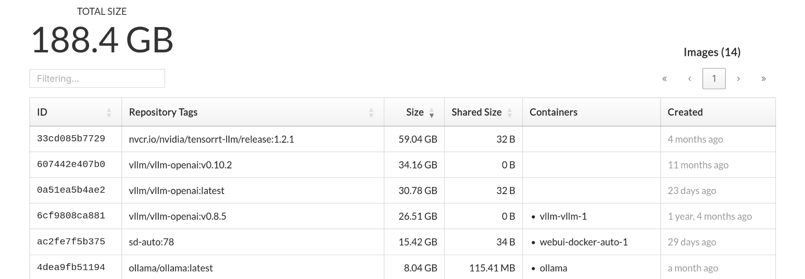

That is such a small improvement that it barely deserves a post. But here it is.

The [Docker post](/home/docker/) ended with a small cheat sheet for reclaiming space. A usual `docker system df` does the job, as long as you remember to run it and look at the results. My NAS *firefly* is a relatively stable environment, but on a homelab machine *serenity* I experiment with new software, run different versions etc. I thought it would be nice to have a quick look at what's using the space and installed Doku.

## Alternatives

There is no shortage of web UIs for Docker. If you already use them for other reasons, you might not need a separate dashboard.

- **Portainer** - the most famous one. It manages everything around Docker, supports multi-host setups and can even do app deployment and templates. Disk usage charts are available, but are spread between the views (volumes, images).
- **Isaiah** - lazydocker in the browser (looks a lot like a terminal app). Also manages all aspects of Docker, but without app deployment. Lighter than Portainer and disk usage charts are more convenient.
- and **Doku** - does nothing except visualise Docker disk usage.

| | Doku | Isaiah  | Portainer |
|---|---|---|---|
| Disk usage charts | the only thing | good panel | OK, but not great |
| Cleanup actions | no | yes | yes |
| General Docker management | no | yes | yes |
| App deployment | no | no | yes |

## Why Doku

I picked Doku precisely because it only does disk usage.

In Portainer and Isaiah you're not only viewing disk usage - you can also delete the offending resources. It's convenient, but it comes with a price: a UI that can manage Docker needs read-write access to the Docker socket. That's a huge attack surface that I don't want to open without a good reason, and viewing charts isn't one. Sure, it's not much difference on a home system behind NAT, but I'd like to keep good practices. 

Doku only reads, so the socket is mounted read-only. If it's compromised, the only risk is leaking info on what software I use. That's orders of magnitude less risky than ability to run arbitrary software with full privileges - which is what full-featured Docker dashboards do. If it means I need to use a terminal to actually delete images, it's no big deal.

And the other management functions, starting/stopping containers, deploying apps?
I don't even want them. I use Docker Compose files, plus Ansible playbooks for my "production" machine (I'm less strict about the homelab server). Another way of doing the same thing leads to configuration drift.

## Installing it

I use an Ansible role to install Docker, so I simply added the tasks at the end of it.

Ansible generates the compose file from a template, since some details are different between my 2 docker hosts.

```yaml
# {{ ansible_managed }}
version: '3.5'
services:
  doku:
    image: {{ docker_host_doku_image }}
    container_name: doku
    restart: always
    environment:
      # Default is 9090, which is taken by Prometheus on our docker hosts.
      - PORT={{ docker_host_doku_port }}
    ports:
      - "{{ docker_host_doku_port }}:{{ docker_host_doku_port }}"
    volumes:
      - /var/run/docker.sock:/var/run/docker.sock:ro
      - {{ docker_host_data_root }}:{{ docker_host_data_root }}:ro
      - {{ docker_host_containerd_root }}:{{ docker_host_containerd_root }}:ro

```

The mounts are `:ro`. The port is remapped because both Doku and Prometheus listen on 9090 by default.

## Security considerations

### Filesystem access

Doku recommends a slightly different volume setup: `-v /:/hostroot:ro`. That is, mounting the whole host's filesystem. Still read-only, but there's no way I'm giving it access to all my files. A disk space dashboard shouldn't need it.

Unfortunately, it needs it for some functions - but they're not crucial. I only mounted Docker's and Containerd's data root (that would be /var/lib/docker and /var/lib/containerd by default, but I moved them to a larger drive - hence the variables).

What doesn't work is Overlay2 sizes - normally, it's very nice, with per-layer breakdown. And if I bind-mount anything from a different path, it won't show up. Everything else works just fine.

### Network access

Doku traffic is unencrypted and unauthenticated by default. I left it like this, cause I only expose it on the home LAN.

It can do HTTP basic auth and TLS. It would only take a few extra lines in the Compose file, though if you want to use LetsEncrypt or another renewal service, you need to script it yourself.

For a bigger deployment (e.g. in the datacentre) I would rather have a reverse proxy in front of it, to handle authentication, encryption and WAF.

## Using it

There's not much to explain. I can go to `http://firefly:9096` or `http://serenity:9096`
and there it is: main page shows total usage and breakdown by type.

Then I can go to images, containers, volumes, build cache etc. It lists the resources of the type, sorted from the largest by default. I could immediately see what's wasting my disk space.



Exactly what I wanted. Doku rescans the data directory on an interval. Even on my limited hardware it's barely noticeable.
