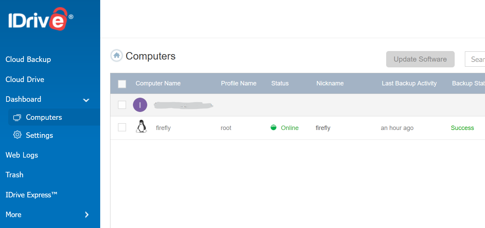

(first written on 2023.11.20, updated on 2026.07.20)

That is against the spirit of self-hosting, but keeping data safe is more important than keeping purity. Your computers can back up to your NAS, that protects you from disk failure, ransomware, accidental deletion and losing your laptop on a train. But a fire or flood can destroy both at the same moment. A proper disaster recovery plan requires 3 copies of data: 1 working copy, 1 on-site backup for quick restore and 1 off-site backup if the previous backup fails. One option is to find another self-hoster and arrange for mutual backup to each other's NAS, another is to use a cloud service.

## Cloud storage choices

Popular options include Google Drive, Microsoft OneDrive and Dropbox. They are convenient for sharing files, but you can also use them for backup. That is, if the space is large enough for you (you can buy more, but it will cost you) and you trust that your files will be private enough for your needs (best way - encrypt them before sending).

Another way is to use an object storage such as Amazon S3, Google Cloud Storage, Azure Blob Storage or many S3-compatible offerings. Some providers have a special tier called cold storage. It's much cheaper than the standard tier, but be careful: you also pay for data retrieval. For an archive or backup that you'll probably never need, this might not be a big issue. A big advantage of such a service is that you can use any backup tool that works with cloud storage (Duplicati, Restic and many others).

## IDrive

Probably the cheapest way to store several TB of data at the time of writing this (November 2023) is IDrive. Their personal plan starts from $99 per year for 5TB, $149 for 10TB, but you can find some affiliate links with a special offer: $4 for the first year. I got mine at <https://www.tomsguide.com/reviews/idrive-cloud-storage-review>. 

Downside of IDrive: this service doesn't provide S3-compatible API, REST interface or any other standard way that's supported by various backup programs. You have to use their own client. Good sides? It's cheap, it's reasonably fast, it offers pretty good security (2FA, encrypted storage and transfer), and it works.

**Update 2026:** current list pricing is $83.88/year for 5TB and $125.88/year for 10TB (there's also 20/50/100TB now), with a first-year or first-two-years discount usually on offer rather than a fixed affiliate rate - check the pricing page for whatever the current promo is rather than trusting the numbers above for long. The bigger change is on Linux: the old set of separate Perl scripts is gone, replaced by a single installer with proper `--install`/`--update`/`--uninstall` flags. See below.

Sending or receiving terabytes of data takes days, even on a fast broadband. IDrive gives an option of using a USB drive for a restore or for initial backup. I haven't used this option, so I can't rate it.

## Getting started

Sign up for an account. It's also wise to turn on 2FA, preferably with a TOTP app.

The whole Linux install story is different now, and much less painful. Debian/Ubuntu and Fedora/CentOS get proper deb/rpm packages from the download page; for anything else there's still a generic package, but it's now a single idriveforlinux.bin. Make it executable and let it install itself:

```bash
chmod a+x idriveforlinux.bin
./idriveforlinux.bin --install
```

The installer creates a default backup set (your home directory) with a daily schedule already attached, so you technically have a working backup the moment it finishes - though I still went in and pointed it at what I actually wanted backed up.

## First backup

The actual app is `/opt/IDriveForLinux/bin/idrive`. It uses a text-mode menu to change settings, restore files, schedule backups or run an immediate backup. I picked a reasonably sized directory (a few GB) for a first test backup, confirmed I could restore it, then went back into the schedule option and pointed it at what I actually wanted backed up long-term.

For restoring (even on another machine), you can also use the web UI.



## What changed since I started using it

Back in 2023, getting the Linux client at all meant asking support for a download link - it wasn't just available on the site like the Windows/Mac ones. What you got was a pile of separate Perl scripts, one per job: `account_setting.pl` to set up the account (which tried to install its own Perl/CPAN dependencies and could fail halfway through), `edit_supported_files.pl` for backup sets, `Backup_Script.pl` to actually run a backup, `Restore_Script.pl` to restore, `scheduler.pl` to set up the schedule, `status_retrieval.pl` to check on it. 

Neither old nor new version is easily scriptable/configurable with Ansible.