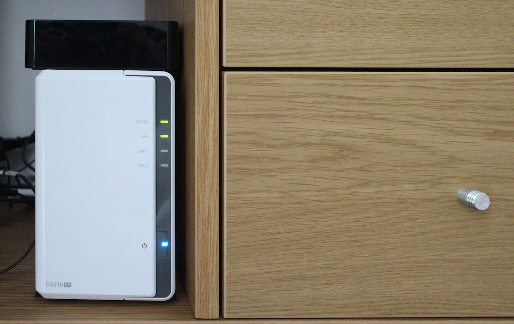
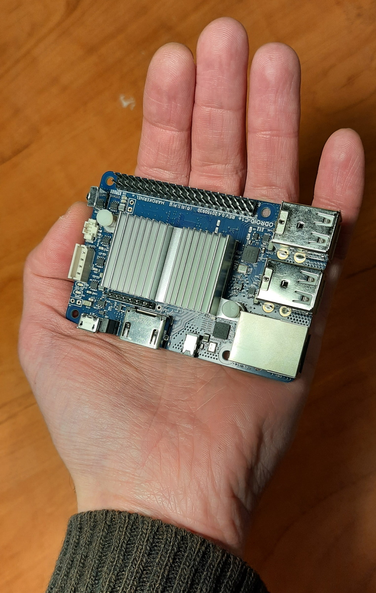
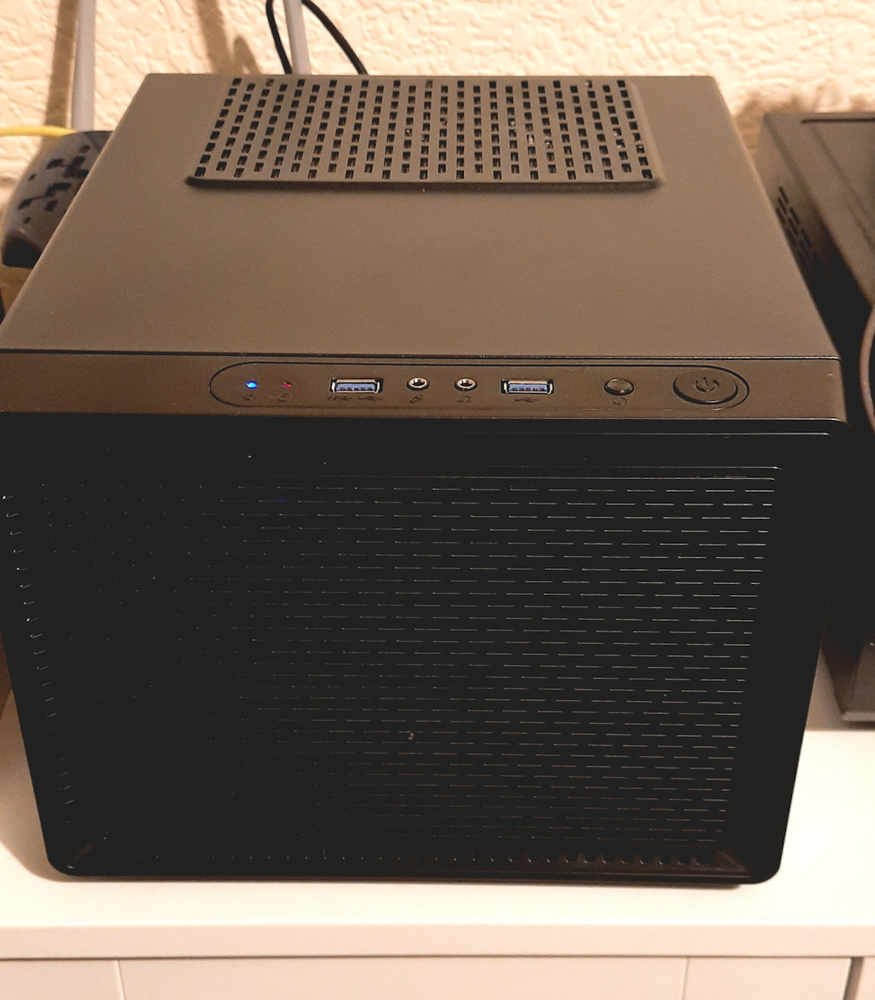

(first published on 2023.03.14, rewritten on 2026.07.07)

A house is not a home without a NAS. OK, maybe I'm not really that emotionally attached to my file server, but it's one of the first things you need if you want to rely less on the cloud. What can you use it for?

- sharing files between the devices,
- storing large data you create, such as photos and videos - laptops and even desktops tend to have smallish SSD drives these days, not really suitable for media content,
- backups,
- storing music, movies and TV shows.

You can also use the same machine as an all-purpose server. With virtualization and containers, it's easy to separate different workloads (you could run everything on the same OS, but the system might get messy).

I'm trying to keep my IT green (see [separate post](/general/green-it/) for details), which in short means:

- the fewer boxes running 24/7, the better,
- prefer old hardware to new one.

## What I have now

Before going into details and considerations, this is my current setup

| Part        | Model                    | source         |
|-------------|--------------------------|----------------|
| Case        | Corsair, unknown (huge) model  |  used    |
| Motherboard | Asus H87I-PLUS, Mini-ITX | used           |
| CPU         | Intel Pentium G3220T     | (came with MB) |
| RAM         | 8GB                      | (came with MB) |
| HDD         | 6 different ones         | new and already owned  |
| SSD         | Plextor PX-256M6S        | already owned  |
| PSU         | Thermaltake Smart BM2 450W | new          |
| other       | extra SATA card          | new            |

## My NAS history

### Commercial vs DIY

The easiest option is to buy an off-the-shelf NAS such as Synology or QNAP. I had one in the past (**Synology DS216se**). The good thing about them is you can get them up and running in less than an hour and without much knowledge. Just install disks, plug it into the network and answer a few questions in the web UI. It's also more compact than even a smallest PC.

But the cheap models only have 2 disk bays, very little RAM and a pathetic CPU. They work fine as basic file servers, but doing anything in the GUI is an exercise in frustration. Click, wait for 10 seconds until it responds, click, wait again. You'll quickly miss the command line. If you want to run any extra services, you're limited by both hardware resources and software available. I used RAID1 for storage so when I ran out of space, the only option would be to replace both disks with the bigger ones, old disks would be useless (or add a USB drive, but that means no RAID). Enough, back to the DIY.

### To USB or not to USB?

I have a drawer full of USB HDDs. A few were mine, most I literally inherited. Many of them are small and not really worth bothering, but about a dozen were 1-2TB. I experimented with a NAS running on a single-board system (**Odroid C1+**) and a small-form PC (**Dell Wyse**) and decided I REALLY don't want a NAS on USB drives. You can run one or two semi-reliably, but the more you have, the probability of problems approaches 100%. Sometimes the plug moves in the socket and you end up with a corrupt filesystem. Or the cable cannot handle the power. Or the disks run fine when you initially connect them one by one, but during the next reboot they will start all at once drawing too much current (yes, I tried a powered USB hub) and only half of them will show up. Of course, you can't have RAID on USB (technically, it is possible, the system wouldn't stop you, but it's a terrible idea if your drives can disappear at any moment).

### Searching for a case

For a NAS, you want a case that can hold many drives: preferably, more than you intend to install at the moment, to have space for extension. Such cases are relatively easy to buy in the USA, but not in Europe. It's quite a niche product after all, very few PCs use more than 1 or 2 drives. Those that can be found are twice as expensive as in the States, buying straight from the US vendor means paying for shipping and long waiting.

But I found one interesting option: **Kolink Satellite Cube**. According to the specs, it had 4x 2.5" and 3x 3.5" bays. And it held a mini-ITX motherboard - not perfect, but OK. It was cheap and quite small. I ordered the case and searched for the MB. Mini-ITX are hard to find, but I found a great second-hand option, with 8GB RAM, a Pentium CPU that's really a 4th generation Intel Core and best of all, 6 SATA ports!

When I got the case, I discovered the specs were wrong in two ways. One, it could hold a mini-ITX or a micro-ATX motherboard, the latter is slightly larger and much more popular. Fine, if I knew that maybe I would have found the motherboard quicker, but I'm satisfied with the one I got. But the other thing was worse. Turned out I can have 4x 2.5" OR 3x 3.5", but not both.

I lived with this limited space until I got tired of it and searched eBay. I found a person nearby selling **Corsair gaming case** and the specs specifically mentioned multiple drive bays. I don't even know how many hard drives it can take, but I put 6 and there's some space left. Plus, the 5.25" drive bays can be reused for HDDs if I need even more.

That also means I can switch to a full-size ATX motherboard in future. Currently, the mini-ITX one I have is enough and can be installed in a huge case, even if it looks funny sitting in one corner of it.

## Hardware considerations - mine and yours

### CPU

If you want only a storage server, or just a few small services on top of it, you don't need much processing power. Any reasonably modern (say, less than 15 years old) mainline CPU from Intel or AMD is already way more powerful than the puny processor in a commercial NAS. Rule of thumb for Intel CPUs: if it's called "Core i-some number", it should be OK. 

If you want more processing power (e.g. for video transcoding), look for something slightly newer - not necessarily new and top of the line. Still more? If you have funds, you can pack an unreasonable amount of CPU power in one box. I used to work with servers that had 2x128 cores, they were used for physics simulations. But I don't have enough imagination to think why anyone would need that at home.

On the other end of the spectrum, there are Intel Atom (for low power usage devices), Pentium and Celeron (budget versions of mainline CPUs). I really wish Intel used a more consistent naming convention. These brands have been in use for decades and without checking the exact model, you won't know if it's just slightly slower than a modern laptop, or a completely unusable 30-year-old junk.

My CPU is Intel Pentium G3220T, which is a slightly slower (no HT, no AVX) version of a 4th generation Core i3. Slow by today's standards, yet most of the time it's only used at 1%. 

Two things worth checking when buying used hardware:

- Does the CPU have **virtualization extensions**? You need them to run VMs at reasonable speeds. All mainline CPUs since roughly 2015 have them, if it's older or unusual - check.
- Intel Xeon and AMD EPYC are server CPUs. Some are power hogs, others scale down just as well as home models. If you find a good offer on them, there's a chance to buy some real processing power cheaply, but check idle power usage. Note that server motherboards might not fit standard PC cases.

I also don't recommend buying CPU and motherboard separately, unless you know what you're doing and how to check the compatibility.

### RAM

For a storage-only server, even small RAM like 1 GB is OK for the start, Linux would only need a few dozen MB anyway and use the rest for disk cache. If you want to run extra services, the answer can vary from "1GB is still enough" to "I have 128G and ran out of memory anyway". But realistically, 4GB should suffice if you don't run VMs. I have 8GB and use less than 2 most of the time.

The situation changes if you want to use ZFS - a modern filesystem with some interesting features, popular among self hosters. 4GB is a minimum, 8GB is better. Personally, I don't like ZFS, more on that in later posts.

### Network

You should connect the NAS using Ethernet, not Wi-Fi. 1Gbit is a reasonable choice, 100Mbit is too slow these days, higher speeds are not necessary for most home users (if you're the one that needs it, you know).

If you really insist on 10Gbit, you should use fibre. While the standard Ethernet cables (CAT6 and higher) theoretically support 10Gbit, the transceivers/NICs often overheat under high load, causing unstable connections. I'm speaking from experience of using 10Gbit at work.

### SATA ports

You'll need a lot of them. Most motherboards have 2 or 4, if you're lucky you might get 6. It's not a big issue: you can install additional controllers. Just make sure you have enough empty PCI Express slots. This is only a concern for small cases and mini-ITX/micro-ATX motherboards, full-size PCs can easily have an unreasonable number of SATA ports.

### Hard drives

3.5" are cheaper, faster, available in larger capacities and are considered more reliable (though it's mostly anecdotal evidence).

2.5" are smaller (obviously). In some PC cases, you can fit more of them. In others, you just have to install a caddy around the 2.5" drive and you still use the same 3.5" bay.

#### SMR controversy

Traditional hard drives use **CMR** (Conventional Magnetic Recording), where each data track is written independently with a small gap between tracks. **SMR** (Shingled Magnetic Recording) drives instead overlap tracks like roof shingles. This allows packing the data more densely, and therefore lower the price of high capacity disks.

But there's a tradeoff. Writes to SMR drives are 3-10x slower than to CMR. Hard drives use write caching to offset this. In normal use, you might not notice the difference. But if you try to write gigabytes at a time, you'll notice write speed begins at reasonable levels such as 250MB/s, but in a few seconds, once the cache is full, slows down to 40MB/s. It's not only an issue for copying large files, but also for RAID rebuilds.

Most budget large-capacity HDDs these days are SMR. Whether you want to pay more for CMR, depends on your use case.

There are several types of SMR, the most popular in consumer hardware is called Drive Managed (DM-SMR). It is invisible to the host, there's no attribute that flags it. Some drives might have SMR in their identification that you can read with `dmesg | grep sda` or `smartctl -i /dev/sda`, but most don't. The only semi-reliable way to check your HDDs is to read the model number (from smartctl data) and look it up on the internet. Semi-reliable, because several manufacturers were caught quietly swapping technology in previously-CMR product lines.

Personally, I have a mixture. Some drives are CMR, because they predate SMR technology. New ones are a mix of both SMR and CMR, when I bought them, I didn't know the difference.

#### Brands and reliability

You've probably met someone who says never to buy Seagate and get Western Digital instead. Or the other way around. The truth, if you look at reliability data (e.g. [famous Backblaze stats](https://www.backblaze.com/cloud-storage/resources/hard-drive-test-data)), is that all manufacturers had some models that failed early and some that exceeded expectations. If you want to shop for reliability, look for specific model, not just the brand. Even that doesn't guarantee that 2026 WD Red 4TB is the same thing as 2024 WD Red 4TB.

Personally, I don't care much. I'm just prepared for any drive to fail at any moment. Instead, if I buy two HDDs at the same time - especially if I plan to use them in RAID1 - I choose two different manufacturers. It's not optimal for array performance (ideally, you would have 2 drives with the same specs), but I'm reducing the chance of both drives failing at the same time.

#### USB drives and shucking

External USB disks are often cheaper than internal 2.5" drives, despite the extra cost of enclosure and electronics. Some can be removed and used as regular drives. The process is called shucking and it's quite popular among self hosters. But there's a reason for lower price: they are built with lower quality components (or they failed QA tests), they might live for years if they are only used occasionally, but won't last long with more intensive use.

Since I had many USB drives, I shucked a few. I used others as external drives (they couldn't be shucked, they are soldered directly to the USB electronics and have no SATA port). About half of them failed in a few months, the other half worked just as reliable as regular HDDs for a few years. I don't use them with the NAS now, though some are still usable. I don't recommend buying USB drives for a NAS, but if you already have them, you can reuse them, just be prepared for failure.

#### The system drive

Should you place your OS with the data or use a separate disk? Both ways have some pros and cons.

- If you use an old motherboard, it might not support booting from large disks - but once the operating system loads, it will access the drives just fine. 
- Most, if not all, NAS-specific distros require a separate system disk.
- Decoupling data from OS will generally make your life easier in the long run: you can replace data disks if they are too small while keeping the system. Or you can move all your data drives to another machine.
- You can also run the system from an SSD which is much faster - it doesn't make much difference if you use it only for NAS, but it could be noticeable if you also want to host VMs or containers.

On the other hand, keeping OS with the data means you don't waste precious drive bay in the case. And if your data is on RAID, the system is also protected from the drive failure.

All things considered, I'd recommend a separate drive.

Tip: if you want to use a separate drive, but don't want to waste drive bay/SATA port/money on the extra disk, you can install Linux on a USB stick. Just remember they are way slower even than HDDs and wear out quickly. You should try to use them read-only (possible but tricky, requires combining read-only fs with a writable ramdisk on top of it, e.g. aufs) or almost read-only (e.g. disable swap, redirect logs to an external system). You can even install the stick internally - motherboards have USB connectors for use with the case's front ports. 

### PSU (power supply)

Buy the **lowest** power PSU you can find. It won't be easy. These days few people build PCs, it seems that these are mostly gamers and crypto miners, both use power-hungry GPUs. A NAS, even with multiple hard drives, will likely not exceed 100W at full load, much less at idle. Old PSUs were very inefficient at very low load, modern ones are better, but still waste a considerable amount of power.

There are certifications aimed exactly at this problem: **80+** means the PSU is at least 80% efficient at any load higher than 20%. The higher the level - they go from White (or just 80+ without a modifier) through Bronze, Silver, Gold, Platinum to Titanium - the better, but more expensive.

Other things worth paying for are reliability and low noise level. Good news: all three factors often go together. Bad news: they also go together with higher price.

Brands recommended in self hosting circles: Seasonic, Corsair, be quiet!, FSP. The one I have (Thermaltake) is considered "not great, not terrible". 
