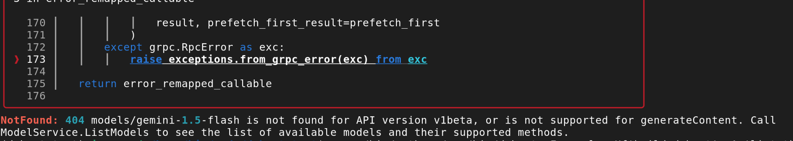
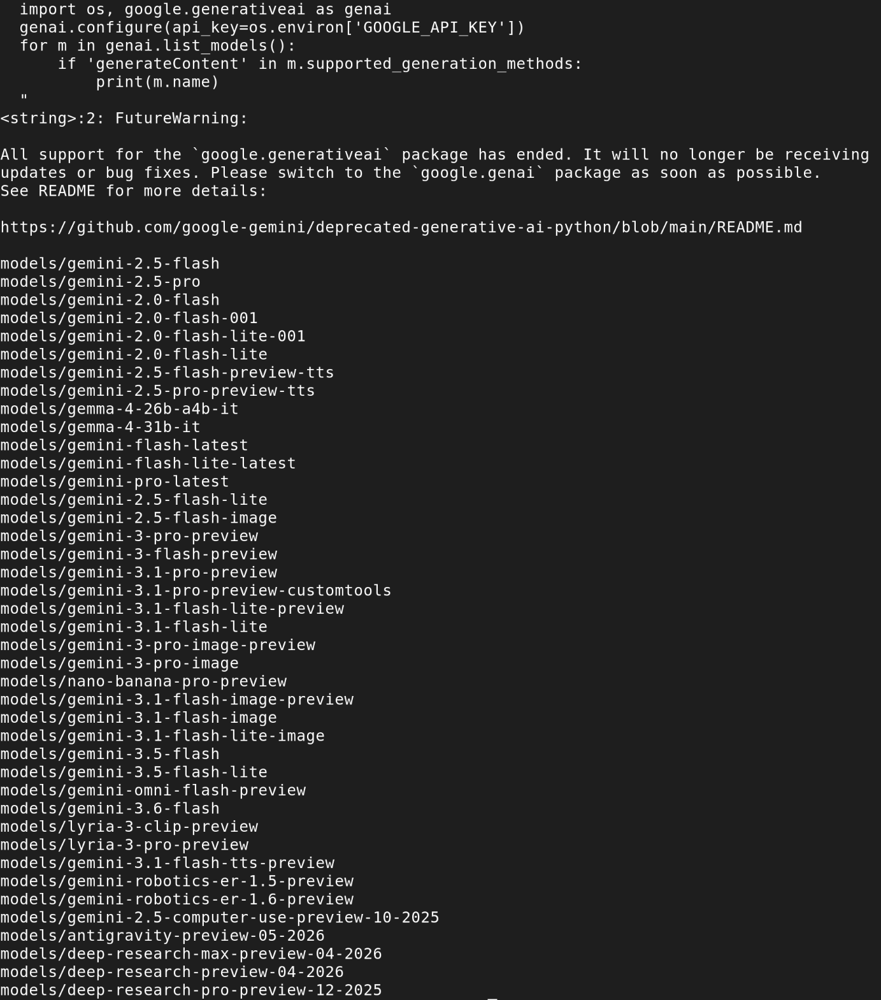
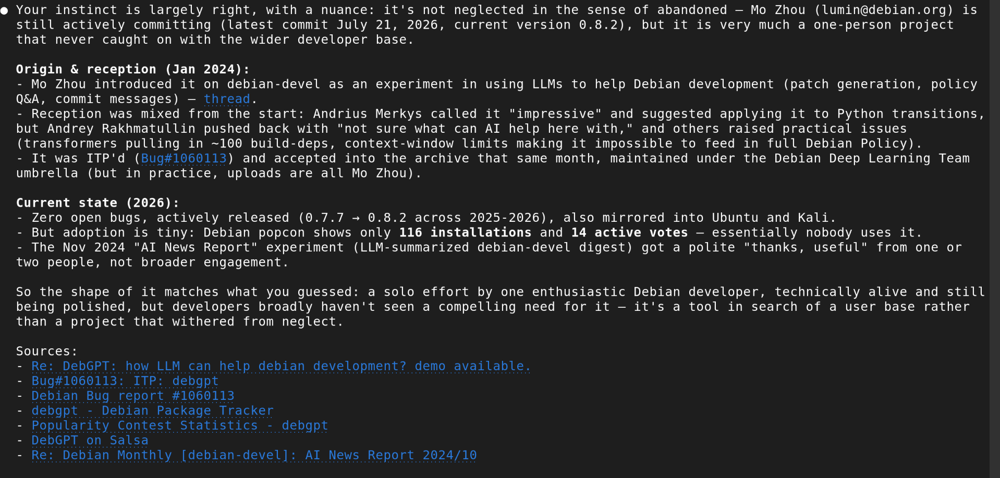

I was searching for ML tools libraries in apt and stumbled upon this. **[DebGPT](https://salsa.debian.org/deeplearning-team/debgpt)** is a terminal tool by Debian developer Mo Zhou, packaged in Debian itself (from Trixie up). The pitch: gather Debian-specific context - policy sections, bug reports, build logs, files - stuff it into a prompt, and send it to an LLM. It's explicitly experimental; the README's own summary of "AI" is "Artificial Idiot".

You might be wondering what's the point of a Debian-specific tool. Let me first explain what's RAG (if you know, feel free to skip the section).

## What's Retrieval-Augmented Generation

RAG - Retrieval-Augmented Generation - is the general pattern of fetching relevant text from outside the model's training data and pasting it into the prompt. Without RAG, the model only "knows" the information that was present in the training data. Which means: nothing that appeared after the training was finished (and retraining the model is costly) and nothing from your personal documents. The model itself doesn't change; you're just handing it better context at query time.

And even if the information was present in the training data, RAG makes the model focus on a specific piece of knowledge - and therefore, give a better answer without straying off-topic. It's useful if getting a wrong answer is costly enough that you want the model grounded in a source you can actually point to.

RAG is everywhere and you've probably used it many times. Perplexity and the "search" mode in most chatbots do it with live web results - fetch pages, drop the relevant text into the prompt, cite the source. Tools that let you "chat with a PDF" or "chat with your notes" (e.g. Google's NotebookLM) are RAG in its most textbook form. Most customer-support chatbots are just these: not a model specifically trained on company data, but a generic-purpose model that injects product info into context.

A similar pattern is also used by [Claude Code](https://www.anthropic.com/claude-code). If you point it at your code or documentation, it will list, grep and read files on demand, and put the relevant pieces into context before answering. That's agentic retrieval rather than the classic RAG setup (which usually pre-indexes a document set with embeddings), but the underlying goal is the same.

In short, RAG makes LLMs massively more useful. But you pay a price for that in token usage, and the context size is limited (especially if you run your own model on a budget GPU). Pulling only the relevant information into context instead of the whole knowledge base makes it usable even on low-end hardware.

And that's the idea behind DebGPT: make it easy to pull Debian-specific info into an LLM of your choice.

## Backends: local or cloud

DebGPT can use one of several backends, selected with `-F` or `--frontend` (I know, confusing, but the author means that debgpt is a frontend to an LLM backend).

- **openai** - the original OpenAI, or anything compatible with OpenAI API.
- that includes **Ollama** - since Ollama exposes an OpenAI-compatible endpoint, pointing DebGPT at `http://localhost:11434` should work the same way as commercial services.
- **vllm** - another self-hosted option that I plan to try one day.
- **zmq** - DebGPT's own built-in backend, also self-hosted. Defaults to Mistral7B (~15GB disk), with Mixtral8x7B available for more VRAM than I have. Fp16 wants 24GB+ VRAM, 4-bit gets a 7B model down to 6GB+ (possibly usable with my card) and CPU-only (fp32) is documented but explicitly not recommended: 100-400x slower.
- **anthropic** - Claude models.
- **google** - Google Gemini.
- **dryrun** - doesn't call anything, just prints the assembled prompt. Useful for debugging. Or if you don't trust it enough to give it an API key, you can look at the prompt and paste it into a chat window manually.

Cloud options need an API key and send queries to a public service. Since I already have [Ollama running locally](/homelab/ollama-openwebui/), that would be an obvious choice for long-term use.

## Debian-specific info

The context-gathering readers are the core idea - each one fetches something into the prompt:

- `policy:7.4` / `devref:5.5` - pulls a specific section of Debian Policy or the Developer Reference.
- `bts:123456` - queries the Bug Tracking System.
- `buildd:package` - build status from the buildd network.
- `man:command` - manual pages
- `ldo:debian-devel/2025/05` - mailing list threads from lists.debian.org

There's also a command `debgpt sbuild` that builds a package using [Debian's sbuild tool](https://manpages.debian.org/buster/sbuild/sbuild.1.en.html) and tries to fix build problems.


## More developer friendly stuff

Some of the commands are not Debian-specific, but aimed at helping software developers in general. DebGPT can be used interactively, but also in batch mode, with query given by `-a|-A` argument, and even as a part of a pipe.

- Context Reader can ingest a file, directory or URL: `debgpt -Hf README.md -a "summarize the file"`.
- Or Google query results: `debgpt -Hx google:'jquery tutorial' -a'recommend a free jquery course'`
- Or a command: `debgpt -Hf cmd:'diff -u old/ new/' -A 'summarize the changes'`.
- Generating a commit message is a simple command: `debgpt git commit`.
- In-place editing of a file: `debgpt -Hi something.py -a 'rewrite the file to use dataclass.'`.

### MapReduce feature

The context size is limited - especially for self-hosted backends - and developers often work with data too large for it: source code, large documentation or mailing list threads. If you use `-Hx` instead of `-Hf`, DebGPT will split the information into context-sized chunks, summarize each one separately, than summarize the summaries.

## Let's experiment

For a change, I wanted to try interacting with Google models (there's a free usage tier, useful if you just want to experiment). I was away from home while writing it and couldn't use my Ollama, but didn't want to wait.

Immediately, I ran into problems. First, it needs Python package google-generativeai which is not packaged in Debian. Pip refuses to install a package without creating a virtual environment (unless forced to do an insecure operation), so I created one with uv:

```bash
mkdir debgpt-test
cd debgpt-test
uv venv --python 3.14 # to match the system-installed python
uv pip install --python .venv/bin/python google-generativeai
```

I then need two environment variables, one for the Gemini API key (can also be provided with a command line argument) and one for the Python path to mix system-wide and venv packages (alternative is to install all required packages into venv, which is The Right Thing for production deployment, but too much hassle for a quick test that just needs one extra library). And I need to prepend each debgpt command with my venv python path.

```bash
export GOOGLE_API_KEY="your-key-here"
export PYTHONPATH=/usr/lib/python3/dist-packages
.venv/bin/python /usr/bin/debgpt -F google -Hf'build:debgpt' -A 'list the build problems, suggest fixes'
```

Immediately, I saw a very colourful error, ending with the information that models/gemini-1.5-flash is not found or not supported. That's a very old, deprecated model (incidentally, google-generativeai is also deprecated, that's why it defaults to an old model).



Let's see which models are available with my key and select something small.

```python
  python -c "
  import os, google.generativeai as genai
  genai.configure(api_key=os.environ['GOOGLE_API_KEY'])
  for m in genai.list_models():
      if 'generateContent' in m.supported_generation_methods:
          print(m.name)
  "
```


OK, I think I finally have a correct environment. Let's try the mailing list reader: `.venv/bin/python /usr/bin/debgpt -F google  --google_model gemini-flash-lite-latest -Hx'ldo:debian-ai/2026/07' -A 'summarize the discussions' --quit`

And I got a reply:

> It looks like you are asking to summarize our conversation history, but there is no previous conversation stored in the current session directory (/home/igor/.cache/debgpt), or this is the start of a fresh session. 

What happened? I tried with `-F dryrun` instead and immediately found that it didn't pull the Debian mailing list into context.

## Current status of DebGPT

At this point, I gave up. It seems that the project is neglected. Not formally obsolete - I checked that the last commit was just a few days ago. But it's a project of one developer, who can't keep up with the rapidly changing tooling.

For comparison, I asked Claude Code to search Debian mailing lists, bug tracker and popularity contest. It confirmed that the package was accepted, is present in Debian, but the engagement is close to zero: few positive reactions, more "I'm not sure it's useful", most devs just ignored it. It also confirmed that a commercial tool can do what DebGPT was supposed to do: gather info from Debian sources, summarise, give links to original documents.



Many open source developers are reluctant to use AI. For good reasons - I'm not a vibe coding enthusiast either. But there's a lot of ground between blindly committing generated code and pretending LLMs don't exist. It's a pity that a free tool that can work with local models (and therefore, doesn't depend on good mood of a corporate sponsor) didn't get more use, at least for low-risk stuff.

## Would it be useful if it worked?

For me - a bit. As a Debian user/admin, I sometimes look for information on Debian mailing lists or bug tracker, but I don't do it daily. I like how the tool tries to use the traditional Unix style (pipe-friendly, CLI interface) and could use it as a generic problem solver.

For Debian developers - a lot. If I were one, I would keep it running all the time.

