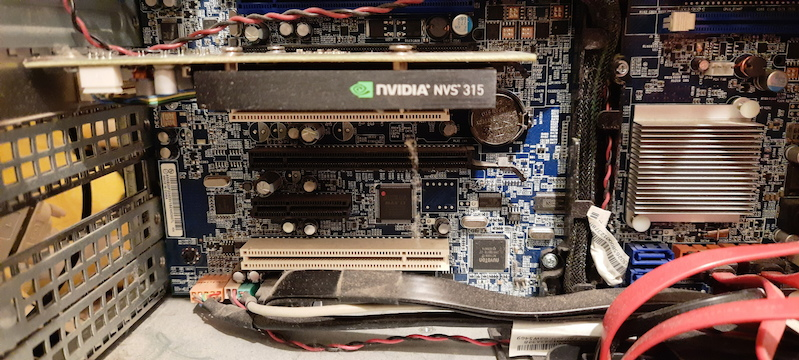
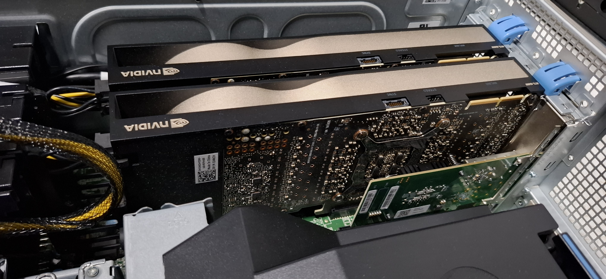

I'm not much of a gamer. I buy laptops with Intel video, my desktops mostly had integrated adapters. There were some exceptions, but not too many. When I decided I need a GPU for experiments, I looked at what I had at home. The only one I found was NVS 315 from 2013. That won't do.

The first part is a shopping guide, next up in part 2 (coming soon) is actually getting it working: drivers, Secure Boot, and Docker.

## What is CUDA

A GPU (Graphics Processing Unit) has hundreds or thousands of small cores. Each of them is slower and simpler than the computer's main CPU, but they do the same operation on lots of data at once. Originally, it was for shading millions of pixels in video games, but the same type of processing works for anything that splits into many independent, parallel pieces: machine learning, video encoding, hash cracking (one secret: almost all of that is just matrix multiplication).

CUDA is a platform - compiler, libraries, drivers - for using those cores for computation instead of display. It's proprietary to NVIDIA - AMD and Intel have their own equivalents (ROCm, oneAPI) - but CUDA got there first, and most libraries, tutorials and tools are written only for it. Which is why this entire shopping list is NVIDIA-only.

### Beyond neural networks: what else I might use it for

- Gaming is the obvious use case, but I'm not much of a gamer.
- Hardware video encode/decode (NVENC/NVDEC) - transcoding for [Jellyfin](/home/jellyfin/).
- Photo and video processing - denoising, upscaling and similar operations can be GPU-accelerated.
- Password/hash cracking experiments with tools like Hashcat - a good way to learn why hash algorithm choice and password length actually matter.

## Setting expectations

For the last few years, gamers have been complaining about GPU availability. New hardware is expensive and often hard to find. Two reasons: first it was mining cryptocurrencies, then the current AI hype.

If you want to run a large neural network (not to mention training one), you need some serious hardware - an A100, an H100, or at a minimum, the very top of the consumer range, an RTX 5090. The RTX 5090 launched at an MSRP of £1919, and even that was optimistic - it's not unusual to see UK retail prices north of £3500, assuming they're even available.

If you want a budget option, you need to look for a used card. But even those aren't exactly cheap. Calling the current market "crazy" doesn't do it justice. Some 10-year-old GPUs are now more expensive than when they were new! 

Luckily, I don't need to train anything large, I want to run CUDA code on a small dataset to learn different ways of GPU computing. For that, a card that's slow by today's standards but CUDA-capable is enough. Technically, even my NVS 315 could run CUDA, but it's not practical even for learning. More on that below.

### Owning a GPU vs renting one in the cloud

Buying hardware isn't the only option, and for the actual large-scale stuff isn't even the sensible one. You can rent a VM equipped with H100 - or a few of them, or a whole Kubernetes cluster - and pay by the hour. For an occasional job, it's much cheaper than buying.

So why buy a budget card at all? Because renting skips experimenting with the hardware/OS side. A cloud GPU instance arrives with the driver and CUDA toolkit already installed, which is convenient, but that's exactly what part 2 is about - installing drivers, the Container Toolkit, dealing with Secure Boot. Plus, if you don't care about performance but you need the machine running for hours while you read tutorials, owning a card might actually be cheaper.

The sensible middle ground: own something cheap for everyday tinkering, and rent a VM for as short as possible when I need more power. Incidentally, I worked for companies that used the same model (although in their case, the "something cheap" still means "more expensive than an average car").

### Compute Capability, and why not to go too old

NVIDIA has made hundreds of models and their naming convention is hard to follow. To make it a bit simpler, every NVIDIA GPU has a Compute Capability (CC) number - it identifies which architecture the card uses and which CUDA instructions and features it supports.

This matters because drivers and toolkits gradually drop support for old architectures. CUDA 13.0, released in 2026, requires **Compute Capability 7.5** or higher, which is **Turing** architecture (the RTX 20-series and GTX 16-series). 

Older cards can run older CUDA and drivers. But older drivers might not work with current Linux kernel and C compiler.

NVIDIA doesn't publish a roadmap of which Compute Capability gets dropped when. What happens instead is a one-cycle warning buried in release notes: an architecture gets marked "to be removed in the next release" in one CUDA version, then it's actually gone in the next one. Maxwell/Pascal/Volta got exactly that treatment - flagged in CUDA 12.9, removed in CUDA 13.0.

As a rough pattern: architectures seem to get about 8-10 years of toolkit support before being cut (Volta launched 2017, Pascal 2016, Maxwell 2014, all dropped together in 2026). Which means Turing (launched 2018) will likely be supported to around 2027, Ampere (2020) to 2029. But that's me extrapolating from 3 data points (using my natural neural network), I hope no statisticians read it.

### More hardware requirements to consider

There might be reasons to get something better than the cheapest Turing board you can find.

#### Additional cores

**Tensor Cores** are a separate kind of core, alongside the regular CUDA cores, built specifically for the matrix multiplication. Machine Learning frameworks run 5 to 10 times faster on Tensor Cores (given the same clock speed and number of cores).

**RT cores** speed up ray tracing math (how light bounces and scatters) - useful for realistic gaming graphics and 3D rendering. Not needed for CUDA, but they often come together with Tensor Cores.

Tensor Cores arrived earlier, with Volta in 2017 (only datacentre cards were made in this architecture). Turing in 2018 added RT cores alongside a second generation of Tensor Cores, and it's this generation when Tensor Cores became available in consumer cards.

Some entry-level cards don't have those extra cores. Worth checking if you plan to run ML workloads.

#### VRAM

**VRAM size** is only important if you want to run something larger. For learning, you can use a small dataset that barely uses any memory. But for an LLM, more capacity is needed. The model needs to fit in VRAM.[^1] For example, a 7-billion-parameter LLM at half precision needs 14 GB.

**VRAM type** also matters for real workloads. Memory bandwidth is often a bottleneck in GPU computing, older cards use GDDR5 at 192 GB/s, while GDDR6 goes up to 288-336 GB/s.

[^1]: Strictly speaking, it's not THAT hard requirement. Tools like llama.cpp or DeepSpeed's ZeRO-Offload can shuffle part of a model (extra layers, optimizer state) back and forth between system RAM and VRAM. It's how people run models bigger than their GPU alone would allow, just slower. You need a sizeable RAM for that (32GB is the reasonable minimum) but that's easier to obtain than VRAM.

#### Floating point formats

Without going into details of floating point arithmetic: numbers can be stored in different ways. You might think higher precision is better, but fewer bits means each value takes less VRAM, and that Tensor Cores can push more of them during the clock cycle. Most ML work doesn't need much precision - which is why frameworks default to smaller formats. In addition to number of bits, it's also the way they're split between range and precision. FP16 and BF16 are both 16-bit, FP16 has more precision but overflows on the large numbers, BF16 keeps FP32's wider range at the cost of precision. Current ML work commonly uses BF16 for training stability and performance.

| Format | Introduced | Architecture (CC) |
|---|---|---|
| FP32 | From the start | Every CUDA-capable GPU |
| FP16 (fast, via Tensor Cores) | 2017 | Volta (CC 7.0) |
| INT8 / INT4 (via Tensor Cores) | 2018 | Turing (CC 7.5) |
| BF16 / TF32 (via Tensor Cores) | 2020 | Ampere (CC 8.0/8.6) |
| FP8 (via Tensor Cores) | 2022 | Ada Lovelace / Hopper (CC 8.9/9.0) |

### Ex-mining cards: why they're a risk, and how to spot one

Most of the affordable cards with CC 7.5 or higher lived through the 2020-2022 cryptomining boom. Mining runs a GPU at close to 100% load, continuously, for months or years - often in a warehouse or garage with poor ventilation, packed edge-to-edge, mounted on cheap PCIe riser cables rather than seated directly in a slot. That's a much harder life than gaming. Constant heat dries out thermal paste and pads, wears down fan bearings. Electronics subjected to higher temperature is more prone to failure.

Some cards are riskier than others. Several models had the specs that made them more suitable for mining. At some point, NVIDIA wanted to differentiate, sold some cards specifically for mining (**CMP** series - to be avoided) and put a hash rate limiter on others.

What to check before buying:

- **The listing** - 20 identical cards from one private seller are highly suspicious, one card with box and accessories suggests private use.
- **Physical inspection** - dust in the heatsink (mining rigs often run open), bent pins on the PCIe edge connector from repeated swaps.
- **Stress test after buying** - There's no error counter to check; actual stability under load is the only real test. On Linux, use `gpu-burn` - run it for an hour and watch for thermal throttling, clock drops, or visual artifacts, and compare the temperatures against published reviews for that model.

A private seller who can show a card's history as a gaming card is worth to pay a few quid more than the average market price. But on the current market, buying a card with unknown history might be the only affordable way into this hobby.

## Hardware gotchas

**Power draw**. Idle draw on modern cards is low, from a few watts to maybe 20 on the biggest cards. Under load they'll pull close to their rated TDP - anywhere from about 40W on a low-end card up to 250W on an old Tesla-class card, and even more on flagship models. Worth checking if your PSU has the headroom.

**Power connector.** Higher-end modern cards use the 12VHPWR / 12V-2x6 connector, which only comes standard on ATX 3.0/3.1 power supplies. An older PSU needs an adapter from multiple 8-pin PCIe connectors, and those adapters have a history of melting. Older or lower-tier cards mostly stick with plain PCIe power, no cable required.

**Physical clearance.** Modern cards are big - 2.5 to 3+ slots thick, 300mm long isn't unusual once you're above entry-level. Check if your case has room, and if adjacent PCIe slots aren't needed.

**No fan on passively-cooled cards.** Some datacentre cards have no fans. They rely entirely on the chassis's airflow. Server cases have high-pressure fans and air ducts. Put the card in an ordinary PC case and it will thermal-throttle under load.

**Confirm the exact SKU.** Card names get used loosely, especially on secondhand listings - RTX 2060 covers three different core counts and VRAM sizes, RTX 3050 in 6GB and 8GB versions doesn't only mean different VRAM size, but also core count, etc. Check the exact model you're going to buy.

## Common cards on the UK market

### Summary

| Card | Architecture | Compute Capability | VRAM | Price (UK) |
|---|---|---|---|---|
| Quadro T400 | Turing | 7.5 | 2-4 GB | ~£90 used |
| GTX 1660 Ti | Turing | 7.5 | 6 GB | ~£90 used |
| RTX 2060 | Turing | 7.5 | 6 GB | ~£100 used |
| RTX 3050 | Ampere | 8.6 | 6-8 GB | ~£125 used, ~£170-190 new |
| RTX 3060 (12 GB) | Ampere | 8.6 | 12 GB | ~£270-400 new/used |
| RTX 3090 | Ampere | 8.6 | 24 GB | ~£600-800 used |
| RTX 4060 | Ada Lovelace | 8.9 | 8 GB | ~£230-290 new |
| RTX 4070 | Ada Lovelace | 8.9 | 12 GB | ~£380-450 used |
| RTX 5080 | Blackwell | 12.0 | 16 GB | ~£980-1100 new |
| RTX 5090 | Blackwell | 12.0 | 32 GB | £1919 MSRP, £3000+ street |

### Global differences

Rule of thumb: bigger market means lower prices. Used GPUs are cheapest in the USA, but I'm not going there anytime soon. UK, also a large market, has a good selection and prices are slightly worse. I live in Sweden now, a much smaller country (by population) and used GPUs are twice as expensive as in the UK, provided you can even find the model you want. I visit England regularly, so I decided to search the UK market.

### The most budget end - Turing

Turing cards (CC 7.5, 2018) are the oldest I would consider. Still supported by the current software. Some models have Tensor Cores, but the most budget models don't.

**Quadro T400** almost always had an easy life. These are corporate workstation cards, usually sourced from a Dell or HP desktop. They have lower performance than gaming models, which means they weren't useful for mining. They were likely used in an air-conditioned office, in well-designed cases and with little load. They don't need the power connector and work with any PSU. Tradeoff - no Tensor Cores and low performance. If you want to experiment without running any real workloads, they're a good choice.

**GTX 1660 Ti** is the popular gaming model from the same microarchitecture. Also no Tensor/RT cores, but more VRAM and more cores than T400. These were sometimes used for mining, but weren't the popular choice.

**RTX 2060** is the cheapest card with Tensor and RT cores (though without BF16) - goes for about £100 used in the UK, barely more than a GTX 1660 Ti. But it's worth knowing which 2060: 

- The original (6 GB, 240 Tensor cores, 160W) is a good choice.
- The Super (8 GB, 272 Tensor cores, 175W) is even better. 
- The RTX 2060 12GB (a late-2021 release) has the same core count as the Super but doubles the VRAM, which sounds tempting. Until you discover that large VRAM compared to core count was exactly what miners needed, and (unlike its Ampere contemporaries) it was never fitted with a mining hash-rate limiter. The odds that a 12GB 2060 was used as a mining card are very high.

### Medium range - Ampere

Ampere (CC 8.6, 2020) is a significant upgrade over Turing. Third-generation Tensor Cores add support for the very important BF16 format. They will likely be supported longer. In fact, they are still sold new.

**RTX 3050** is the cheapest way onto Ampere. It comes in 6 GB and 8 GB flavours (which also have different core counts) and it's positioned as a gaming card. It shipped during the mining boom, but it wasn't a priority target for miners, who mostly chose bigger cards.

**RTX 3060** is a faster variant. And again it comes in different versions: the 8 GB variant isn't the 12 GB card with less memory, it's a narrower 128-bit bus instead of 192-bit, which drops bandwidth from ~360 GB/s to ~224-240 GB/s. And "RTX 3060 Ti" is a different GPU die entirely (GA104, shared with the RTX 3070), not a minor bump on the same chip - worth not reading "Ti" as "a bit faster" here.

### Higher range

Any upgrade over that - newer architecture, more cores or more VRAM - means doubling the price. At least. I only did a bit of market research and decided I don't need to go there.

## What I got

I decided that RTX 3050 6GB is a sweet spot. Only slightly more expensive than Turing cards and BF16 is worth the difference. Anything higher would be massively more expensive and would give me performance that I don't really need, but the same software support as the cheapest Ampere model.

After some searching I found a good deal on a new GPU. About £10 more than non-shady used GPUs, but comes with warranty and invoice. Against my usual rule of buying used, but hey, it's the first new GPU I bought in this century.

## What about high-end cards and multi-GPU?

Everything above assumes one budget card in an ordinary desktop, because that's what I have at home. But I work with high-end and multi-GPU setups, and a few things are different:

- **Power draw.** Top-end cards pull 300-500W each, and you usually have a few in each box. GPU servers need a PSU of 1500W or more. Put several such servers together and you might exceed power limits of the rack.
- **Cooling requirements.** All those watts end up as heat. Your cases better have multiple high-pressure fans. It's not uncommon to see temperatures over 80°C on the exhaust side of the workstation, and that's with cooled air on the intake.
- **PCIe lanes become the bottleneck.** A consumer desktop CPU only has 16-24 lanes total. One GPU at x16 is fine; two usually means both drop to x8. Full-bandwidth multi-GPU needs a workstation/server platform.
- **ECC VRAM and NVLink** show up on high-end and datacentre cards, neither of which exist anywhere in the tier this guide covers.

