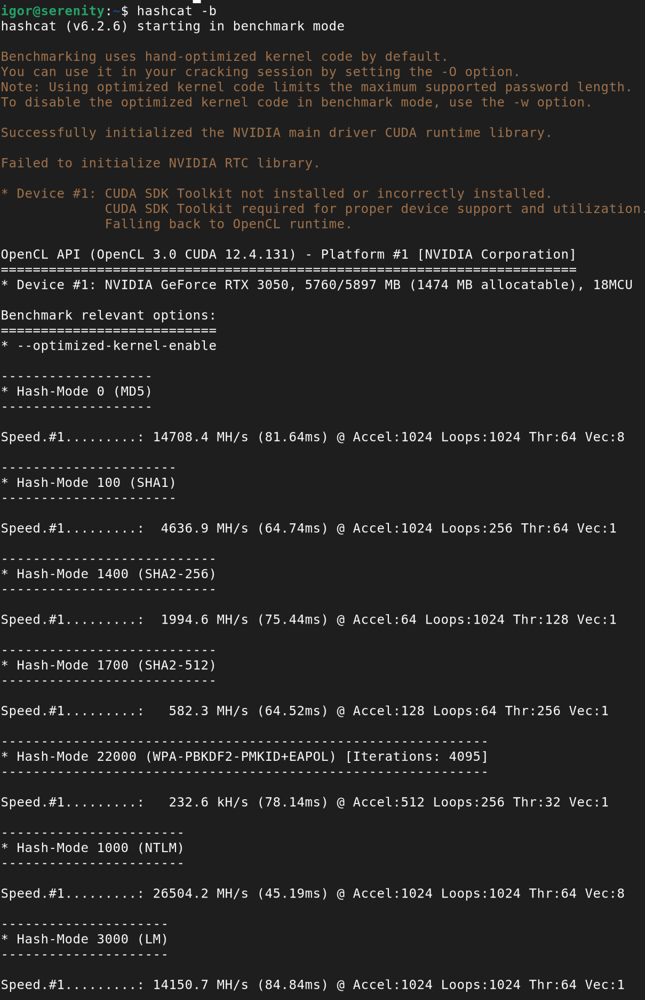
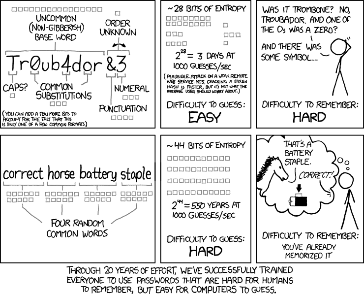
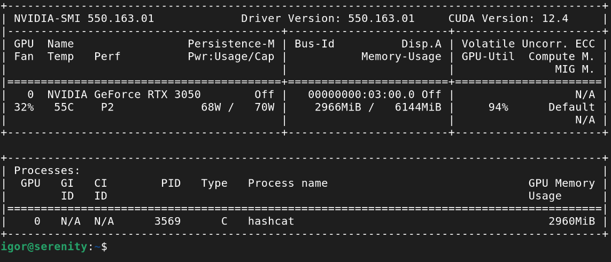

[Part 1 of the GPU guide](/homelab/gpu-guide-1/#beyond-neural-networks-what-else-i-might-use-it-for) had password cracking on the original list of possible experiments. It's not Machine Learning at all, but a GPU is useful for exactly the same reason: it takes lots of small, independent, identical operations.

The usual warning: don't crack someone else's passwords. There are legitimate uses for hashcat: one example is an authorised penetration test, the other is education. Specifically, to see for yourself why password choice matters.

## Hashing: how most systems store passwords

Storing passwords in plain text would be terribly insecure. Encrypting the passwords with a symmetrical algorithm is perfectly fine for a tightly controlled single-user system (e.g. a password manager), but not good enough for a multi-user system: encryption is reversible by design and the system would need to hold the encryption key all the time. Therefore, whoever steals the key along with the database, or tricks the system into using its password decryption function - could read every password directly.

A login system doesn't really need to know the original password, only to check whether a password entered during a login attempt is the same as the user entered previously. So, a one-way function is enough: a **cryptographic hash**. Store the hash; when someone logs in, hash their attempt again and compare the two. Even if someone steals the whole database, they won't have a way to decrypt all the passwords. The only way would be to try hashing all the possible combinations until they find a match.

That idea is old. Early Unix in the 1970s used it already. What changed was the algorithms used - with the increase in CPU power, what was considered uncrackable (as in: it would take millions of years to try all possible combinations) became doable for a determined individual. *DES* was phased out in the 1990s, replaced first by *MD5*, then *SHA2*. In recent years, GPU computing changed the picture and led to the development of new algorithms.

### Why a GPU cracks passwords fast

Traditional hash functions mostly use few simple operations such as modular addition and XOR, repeated thousands of times. They don't require much memory and parallelize extremely well. A GPU is hundreds of times faster than a CPU of the same era. How much faster, exactly? We'll see in a moment.

This only matters for old hash functions. New algorithms are built specifically to prevent GPU cracking - e.g. bcrypt, scrypt, Argon2 - are deliberately memory-hungry and computationally expensive. They're still faster on a GPU than on a CPU, but slow enough on both that brute force password cracking is not practical.

Enough explaining, time for the experiment.

## Using hashcat

### Installing on Debian

Debian packages a "password recovery utility" called hashcat. My first attempt was a simple: `sudo apt install hashcat`. This worked, but also installed a surprising amount of LLVM. Hashcat's Debian package depends on one of several *-icd* (installable client driver, a parallel programming standard) packages, and it just happens that *pocl-opencl-icd* is the first on that list. POCL means Portable Computing Language - a CPU-only, software implementation of OpenCL. It JIT-compiles OpenCL C kernels to native code at runtime using Clang and LLVM as its compiler backend - hence the LLVM packages.

That means hashcat would run on CPU. I wanted the NVIDIA driver, but also decided to install POCL as well, to compare the devices. So the command I used was `sudo apt install nvidia-opencl-icd pocl-opencl-icd hashcat`.

`hashcat -I` lists the OpenCL platforms it can see - with both available, it defaulted to NVIDIA. But it printed a warning:

```YAML
Successfully initialized the NVIDIA main driver CUDA runtime library.
Failed to initialize NVIDIA RTC library.

* Device #1: CUDA SDK Toolkit not installed or incorrectly installed.
             CUDA SDK Toolkit required for proper device support and utilization.
             Falling back to OpenCL runtime.
```

That's a minor problem: hashcat prefers a CUDA-native backend over OpenCL and warns it's not available. That backend needs NVRTC (NVIDIA Runtime Compilation) to JIT-compile its kernels at runtime. Without it, hashcat falls back to OpenCL. But I wanted to fix it anyway.

The minimal-looking fix didn't work: `sudo apt install libnvrtc12`. Same warning.

Digging into hashcat's source (ext_nvrtc.c) explains why: on Linux it only tries two exact filenames, libnvrtc.so and libnvrtc.so.1. Debian's libnvrtc12 only ships libnvrtc.so.12 and the fully versioned libnvrtc.so.12.4.127. The libnvrtc.so symlink is normally shipped by *nvidia-cuda-dev*, meant for compiling against the library, not loading it at runtime. That's a bug in Debian packaging, if you ask me.

The simplest workaround I found on the web is to manually create the symlink: `sudo ln -s /usr/lib/x86_64-linux-gnu/libnvrtc.so.12 /usr/lib/x86_64-linux-gnu/libnvrtc.so`

But I just installed the full toolkit: `sudo apt install nvidia-cuda-toolkit`. That pulls a few hundred MB of packages including nvidia-cuda-dev, much more than hashcat needs. But I'll need those later anyway for other CUDA experiments, so I might as well install them already.

As it turned out, hashcat on CUDA and OpenCL works with more or less the same speed. The differences were 5% to 20%, both ways - some algorithms faster on CUDA, others on OpenCL.

### Benchmarking



First thing I did was a built-in benchmark, `hashcat -b`. The list is quite long, so I took a hopefully representative sample, put it in the table below and also ran those selected benchmarks on CPU:

```bash
for m in 1000 0 1400 1700 1500 500 22000 1800 3200 11300; do
  echo "=== MODE $m ==="
  hashcat -b -m "$m" -d 3 -D 1 --force
done
```

Hashcat really doesn't want to run on CPU if GPU is available, not only I had to select the device, but also use the force flag.

| Algorithm | GPU | CPU  | GPU / CPU |
|---|---|---|---|
| NTLM | 26.5 GH/s | 488 MH/s | 54x |
| MD5 | 14.7 GH/s | 304 MH/s | 48x |
| SHA2-256 | 2.0 GH/s | 68.1 MH/s | 29x |
| SHA2-512 | 582 MH/s | 18.8 MH/s | 31x |
| DES (descrypt) | 574 MH/s | 4.6 MH/s | 125x |
| md5crypt (1,000 iterations) | 5.9 MH/s | 23.6 kH/s | 250x |
| WPA-PBKDF2-PMKID+EAPOL (4,095 iterations) | 233 kH/s | 8.4 kH/s | 28x |
| sha512crypt (5,000 iterations) | 95.7 kH/s | 2.5 kH/s | 38x |
| bcrypt (cost factor 5) | 21.5 kH/s | 158 H/s | 136x |
| Bitcoin/Litecoin wallet.dat (200,459 iterations) | 3.05 kH/s | 90 H/s | 34x |

#### CPU vs GPU

Serenity's CPUs (dual Xeon E5-2609) are not exactly new. But a modern consumer CPU would be about 4x faster than those 2 combined. I would need a datacentre CPU like a 128-core AMD EPYC to achieve speeds comparable to a budget GPU.

The speedup is not universal though, some algorithms parallelize better than others. What's interesting is that new hash functions don't target the GPU architecture specifically. In fact, bcrypt achieves one of the biggest speedup factors. They are just made slower on everything.

#### Algorithms

Top to bottom, that's close to seven orders of magnitude. 

**NTLM** shows how little Microsoft cared about security in the 1990s. It was considered weak even when it was introduced in 1993: single unsalted round of MD4. To be fair, it wasn't crackable by 1993 hardware (except for very short or dictionary passwords, but that's a problem regardless of the algorithm), but it became crackable before the decade was over. And it wasn't fully phased out yet! NTLMv2 has an improved challenge-response mechanism but the same hash; Kerberos, much stronger, is a default protocol for domain logons since Windows 2000, but NTLM is still used for non-domain computers.

**MD5** should not be used for storing passwords. Like MD4 before, it was designed as message digest algorithms, to check that a transferred file arrived without any alterations. Currently, it's only considered proper to check for accidental corruption or for non-security uses (e.g. using hash as a lookup key for table indexing, sharding, deduplication etc.). Not only it's fast (which is what you want when you're working with massive data, but not with small and highly sensitive password databases), but since 2004 there are known collision attacks.

**DES (descrypt)** is the odd one out. It was developed in the early 1970s, yet it seems more resistant than 2001 SHA2. But if you chose it based only on hashes per second, you would be very wrong. The algorithm is weak for several other reasons: the password is truncated to 8 characters and the salt is only 12 bits. The design was criticised since the beginning, and in 1998 a brute-force attack (though on a $250k machine) was demonstrated.

**Everything from md5crypt down** was deliberately built to be slow per guess, by repeating the underlying primitive hundreds or thousands of times (the *N iterations* hashcat prints for each mode). md5crypt still uses a fast primitive - plain MD5 - repeated 1,000 times, and it shows: 5.9 MH/s is a significant improvement over older algorithms, but pales in comparison with sha512crypt or bcrypt. They pair a deliberately slow primitive with iterations, and hence they go from millions to thousands of hashes per second.

One caveat on the **bcrypt** figure: hashcat's benchmark uses bcrypt's cost factor 5 (meaning 32 rounds). Real deployments default to cost factor 10-12 (1,024-4,096 rounds), which would put an actual bcrypt hash 32-128x slower again - closer to a few hundred H/s, not 21.5 kH/s.

## Password length matters

### Calculating the problem space

We now know how many passwords a GPU can try per second. But how many passwords of a given length are possible?

I must admit I hate combinatorics. I can never remember if that value I'm looking for is permutations or combinations (I just checked, it's neither - it's *permutations with repetition/variations with repetition* depending on the country). Then perhaps my choice of getting a Computer Science degree was odd, but at least I can write a short Python script when I need to check that kind of thing.

```python
from decimal import Decimal

charsets = {
    "lowercase only": 26,
    "lower + upper case": 52,
    "letters + numbers": 62,
    "alphanumeric + punctuation": 94,
}
lengths = [4, 6, 8, 10, 12, 14, 16]

for length in lengths:
    row = [str(length)]
    for name, size in charsets.items():
        n = size ** length
        millions = Decimal(n) / Decimal(1_000_000)
        row.append(f"{millions:,.2f}")
    print(row)
```

All values in the table below are in millions. Long numbers might be hard to compare, but still easier than quintillions and other names that nobody uses.

| Length | Lowercase only | + Uppercase | + Numbers | + Punctuation |
|---|---|---|---|---|
| 4 | 0.46 | 7.31 | 14.78 | 78.07 |
| 6 | 308.92 | 19,770.61 | 56,800.24 | 689,869.78 |
| 8 | 208,827.06 | 53,459,728.53 | 218,340,105.58 | 6,095,689,385.41 |
| 10 | 141,167,095.65 | 144,555,105,949.06 | 839,299,365,868.34 | 53,861,511,409,489.97 |
| 12 | 95,428,956,661.68 | 390,877,006,486,250.19 | 3,226,266,762,397,899.82 | 475,920,314,814,253,376.48 |
| 14 | 64,509,974,703,297.15 | 1,056,931,425,538,820,521.59 | 12,401,769,434,657,526,912.14 | 4,205,231,901,698,742,834,534.30 |
| 16 | 43,608,742,899,428,874.06 | 2,857,942,574,656,970,690,381.48 | 47,672,401,706,823,533,450,263.33 | 37,157,429,083,410,091,685,945,089.79 |

Each column adds a character class on top of the last: lowercase (26 characters), lower plus uppercase (52), letters plus numbers (62), letters and numbers plus punctuation (94).

### Brute force feasibility

Let's compare it with our benchmark. Supposing our system uses MD5. A 6-character alphanumeric password means ~56800 million of possible passwords and the GPU checks 14700 million hashes per second. It only takes 4 seconds to check all of them. Oops. Adding punctuation, which is considered very secure by most web forms, only increases it to 47 seconds. On the other hand, moving from 6 to 10 alphanumeric characters increases the time to ~57095000 seconds or about 660 days.

One thing that should be known at least since a [famous XKCD comic about password strength](https://xkcd.com/936/): a long password, even if it's all lowercase, beats a short, "complex" password. Keyspace size is character-set size to the power of length. Changing the exponent makes a stronger impact than changing the base.




The same cracking attempt with a 6-character alphanumeric password, but on a modern system with bcrypt[^1], takes 2641860 seconds to check the whole problem space. That's about 30 days. Not great, but much better. 10-character password needs ~39037180000000 seconds. That's about 1.2 million years, if I haven't made an off-by-one-order-of-magnitude error. If a homo erectus had my NVIDIA RTX and started cracking right after the species arrived in Europe, the task would be almost complete by now.

### Brute force test

Let's see if the estimates are true. For MD5, that is, I'm too impatient to wait for some millions of years. I generated 20 random 6-character passwords (alphanumeric plus punctuation) and hashed them with MD5.

```bash
python3 - <<'EOF' > plain.txt
import random, string
charset = string.ascii_letters + string.digits + string.punctuation
for _ in range(20):
    print(''.join(random.choice(charset) for _ in range(6)))
EOF
```

```bash
while read -r pw; do
  printf '%s' "$pw" | md5sum | awk '{print $1}'
done < plain.txt > hashes.txt

paste -d: hashes.txt plain.txt > mapping.txt
```

File mapping.txt now holds `hash:plaintext` pairs - to compare against hashcat's results. And the command looks like this: `time hashcat -m 0 -a 3 -o cracked.txt hashes.txt ?a?a?a?a?a?a -O`

- `-m 0` selects MD5 hash
- `-a 3` means attack mode = bruteforce
- `-O` requests the optimized kernel (at the cost of a lower maximum supported password length, 55 characters here - no issue for this test)
- `-o cracked.txt` writes `hash:plaintext` for every hash it cracks, same format as mapping.txt
- Finaly, the mask `?a` is hashcat's "any printable character" repeated 6 times (that also includes space, close enough).

Ran on Serenity, as usual checked how the GPU is doing:



And soon I got this result:

```
Session..........: hashcat
Status...........: Cracked
Hash.Mode........: 0 (MD5)
Guess.Mask.......: ?a?a?a?a?a?a [6]
Kernel.Feature...: Optimized Kernel
Speed.#1.........:  8367.5 MH/s (8.33ms) @ Accel:16 Loops:256 Thr:1024 Vec:8
Recovered........: 20/20 (100.00%) Digests (total), 20/20 (100.00%) Digests (new)

Started: Fri Aug  7 21:24:59 2026
Stopped: Fri Aug  7 21:26:23 2026

real	1m24.814s
```

Timing was a bit off from the initial estimate of 47s, strangely - in both ways:

- Hashcat's `?a` mask also includes space, that's one more character, so checking full space should take 1m34s
- The speed was now slower, 8.4 GH/s here versus the 14.7 GH/s from the benchmark. Hashcat's own hint explains it - "Create more work items to make use of your parallelization power" - a 6-character keyspace cannot fully saturate the GPU.
- Self-test and autotune takes a few seconds, for a longer run that would be irrelevant, but for a small task it's a signifcant percentage.
- Hashcat didn't need to check the full keyspace to find all the hashes.

Anyway, the estimate was close enough to be useful.

Now let's see the results: `cracked.txt` isn't reset between runs and I did a few other experiments before getting all the commands right, so first step is to filter the newest only. Then a small Perl one-liner to decode the output - two of the random passwords contained a `:` character, hashcat encoded those as `$HEX[...]` so the colons are not mistaken for the field separators. 


```bash
grep -F -f <(cut -d: -f1 mapping.txt) cracked.txt > cracked_this_run.txt
diff <(sort mapping.txt) <(sort cracked_this_run.txt)
perl -pe 's/\$HEX\[([0-9a-f]+)\]/pack("H*", $1)/ge' cracked_this_run.txt > cracked_decoded.txt
diff <(sort mapping.txt) <(sort cracked_decoded.txt)

cut -d: -f1 mapping.txt | while read -r hash; do
  orig=$(grep "^${hash}:" mapping.txt | cut -d: -f2-)
  cracked=$(grep "^${hash}:" cracked_decoded.txt | cut -d: -f2-)
  [ "$orig" = "$cracked" ] || echo "collision: hash=$hash original=$orig cracked=$cracked"
done
```

No output means every hash cracked back to the exact original string. If there's a difference, it's either a hash that wasn't cracked or an MD5 collision (a different string giving the same hash). Both would be extremely unlikely with only 6-character strings. As expected, there was no output.


## Dictionary attacks

Few people use truly random passwords. If they need to type it, not copy/paste from a password manager, and especially if they want to remember it, they tend to choose common words, often related to them in some way.

Criminals know that and before (or instead of) a brute-force attack, they use a dictionary attack. Wordlists are widely available. A famous one known as rockyou.txt contains 14 million real passwords from a data breach at the RockYou company which stored passwords in plain text.

Hashcat can do that too. A command could look like this: `hashcat -O -m 0 -a 0 hashes-to-check.txt rockyou.txt`
I haven't run this test though. For the passwords that I hashed myself, it would be pointless. Just see the benchmark results - hashcat can check the whole dictionary against MD5 instantly and against bcrypt in a few hours.

If you can get a permission to run it on a real password database though, that could make some useful observations.

### Rule attacks

A common way of satisfying password requirements is adding a digit or two at the end. That surely makes the password secure? Well, it just increased the problem space 100x. Which isn't much, especially if the original estimate was 4s.

And of course hashcat can do that too. Combine dictionary attack with rules how to transform the words and you'll get: `hashcat -O -m 0 -a 0 hashes-to-check.txt rockyou.txt -r /usr/share/hashcat/rules/best64.rule`. Hashcat comes with several rule files, this one contains the 64 most common transformations, e.g. appending a digit or punctuation, capitalising first letter, duplicating a word.

## What have I learned

- Password hashing algorithms matter. While writing this I confirmed my systems use a modern algorithm (yescrypt).
- Password length matters even more.
- Common requirements such as using characters of several classes don't make good passwords. A dictionary word with simple transformations satisfies them, yet it's easily crackable on modest hardware.
- When you need a memorable password, XKCD's advice about combining several words still stands. 4 dictionary words aren't as good as a long and truly random string, but beat the popular choices. 
- We've made huge progress in processing power since the early 1990s when I started using computers. One gradual with CPU power and one leap with GPU computing.

[^1]: I used hashcat's assumption of cost factor 5. Real system used 10-12, that would make ~3-11 years for the 6-char password and 40-160 million years for the 10-char one.