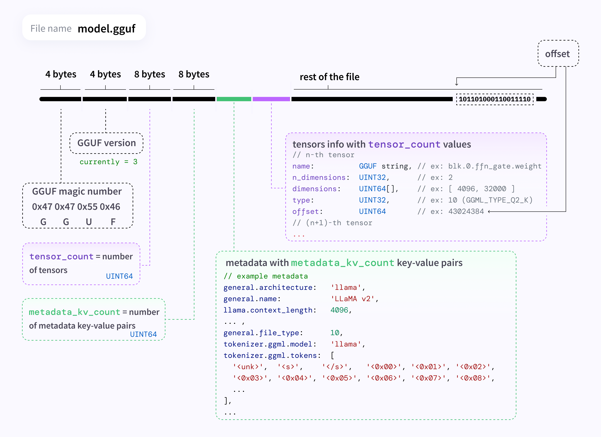
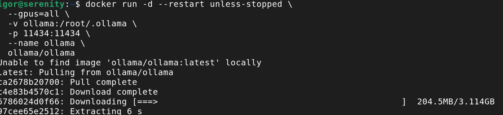
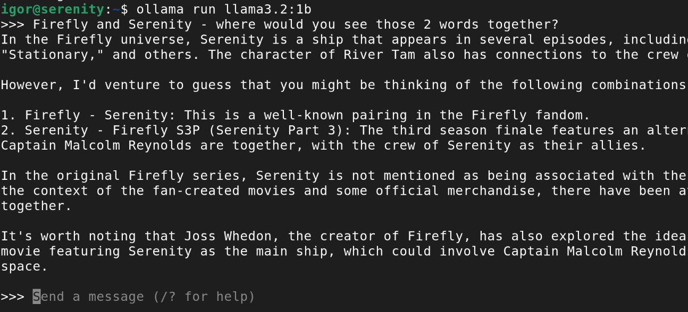
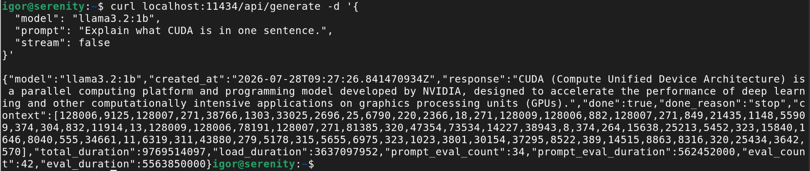
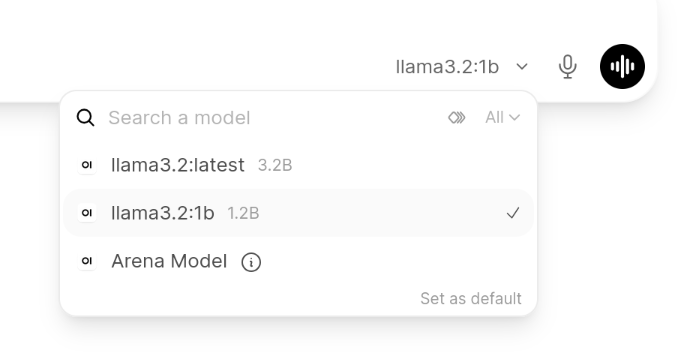
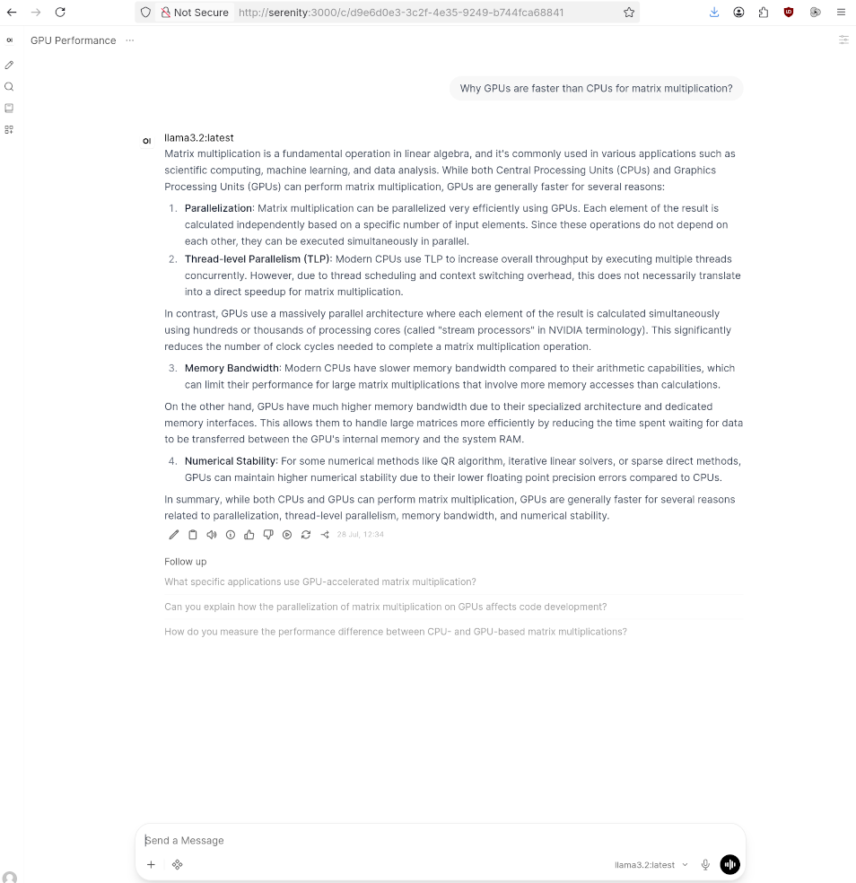

Now that I have a GPU, it's time for experiments. The obvious first thing is to run a local LLM.

## What's possible on my hardware

The impressive models powering ChatGPT or Claude require several hundred GB of VRAM. My GPU has 6GB. There are some ways to reduce hardware requirements, but even with them I won't be able to host anything practical (for a chatbot or agent, that is - there are other uses). High-end consumer GPUs can run a limited model that serves a real purpose, but my card is far from high-end. I expect my chat to be slow - few tokens per second - and prone to hallucinations. In a few moments, I'll see if I'm right.

On the other hand, making the model work acceptably on a limited hardware is actually a useful skill.

## Where to get models

The best current models are tightly kept secrets, but companies decide to publish some of their work as **open weight**. That is the equivalent of Open Source in the ML world (though the analogy isn't perfect: the training data and code usually aren't published, only the result).

**[Hugging Face](https://huggingface.co/)** is a hosting platform for machine learning models and datasets. Like GitHub, but for ML. You can browse the models from the web interface and download them directly.

**[Ollama library](https://ollama.com/library)** is where Ollama - the tool described below - downloads from.

There are several file formats for publishing models, the most popular is **GGUF**. It's a convenient package: one file per quantised model, storing the weights together with the tokeniser, neural network structure and metadata. The full layout is documented in the [GGUF spec](https://github.com/ggml-org/ggml/blob/master/docs/gguf.md).



*Diagram by [@mishig25](https://github.com/mishig25), from the GGUF spec (MIT-licensed).*

## Reducing hardware requirements

### Quantisation

Models are trained and originally published at FP16 or BF16 - the formats from [GPU part 1](/homelab/gpu-guide-1/)'s floating point table - because it's optimal for training stability. That means 16 bits, or 2 bytes, per parameter. Inference - using the model - can work with lower precision numbers.

**Quantisation** is reducing that precision after training, storing each weight in fewer bits. Common levels are Q8, Q6, Q5, Q4 and Q2 - that many bits per weight. Though the "K-quants" most people use (*Q4_K_M*, *Q5_K_S*, etc.) mix bit-depths - e.g. Q4_K_M might use Q6 for the most important parts of attention and feed-forward tensors, Q4 for everything else, making it slightly larger than 100% Q4 but more stable. And the S/M/L suffix is a size/quality tradeoff within that same nominal bit count. Confused? Don't worry about that, just experiment.

As a rough rule of thumb, size in GB is **parameters (billions) × bits ÷ 8**. A 7B model at BF16 needs 14GB just for the weights, reduced to Q4 is about 3.5GB - more, since some weights likely use a larger format. Right size for my 6GB card - I need to leave some space for context and other purposes.

### Distillation

The largest Open Weight models - e.g. DeepSeek-V4 - are well over 1T parameters. The same creators publish much smaller models. **Distillation** means a "student" model is trained to mimic a larger "teacher" model's outputs, rather than being trained from scratch on raw data alone. The idea being that the teacher's outputs already encode a lot of what's worth learning, so the student converges on more capability per parameter than an equivalently-sized model trained the usual way.

### Tradeoffs

The two techniques work together: distillation shrinks the parameter count, quantisation shrinks the bits used to store each parameter. But there's a cost.

Smaller and less stable models are more prone to hallucinations than LLMs you know from publicly available chats. Not only do they fabricate facts, they often include words from other languages in their output or drift completely off topic.

Some models are trained for a specific task, rather than being universal. For example, Polish model [Bielik](https://bielik.ai/) is mostly trained on Polish sources and despite small size (11B full model, I tested 7B/Q4) can answer Poland-related questions correctly, but struggles on everything else.

### Using VRAM and system RAM together

An LLM is made of identical transformer layers, and there's nothing stopping different layers living in different places - llama.cpp (and Ollama on top of it) loads as many as will fit into VRAM, and puts the remainder in ordinary system RAM. But that means the parts that sit in RAM are computed on CPU, which obviously can't do massively parallel processing. Offloading even a small part of the model to RAM has a huge impact on how many tokens per second it can process. But it's the only way to load a model larger than VRAM. In theory, I could even load a full-blown LLM into swap space, but I wouldn't like the inference speed.

## Software stack that I tested

The most popular engine for small platforms is **[llama.cpp](https://github.com/ggml-org/llama.cpp)**. It runs GGUF models directly. It gives the most control, but requires a lot of manual work.

**[Ollama](https://ollama.com/)** is a wrapper around llama.cpp that turns it into something with a package manager: `ollama pull <model>`, `ollama run <model>`. Most of llama.cpp's capability, much less of the manual setup. Ollama also runs on Windows and MacOS and can use cloud models in addition to local ones, but I haven't used that.

**[Open WebUI](https://openwebui.com/)** is a chat frontend, that gives a nice web GUI and talks to Ollama's REST API.


## Ollama

### Installing Ollama 

Ollama ships an official Docker image. First run downloads a few GB, so be patient:

```bash
docker run -d --restart unless-stopped \
  --gpus=all \
  -v ollama:/root/.ollama \
  -p 11434:11434 \
  --name ollama \
  ollama/ollama
```



`-v ollama:/root/.ollama` keeps downloaded models in a named volume rather than inside the container, so they survive an image update. A quick check that it's alive:

```bash
curl localhost:11434
```

which should just reply *Ollama is running*.

### No GPU?

You can still run Ollama without a graphics card. It falls back to running entirely on CPU, the commands and API don't change (you only need to remove `--gpus=all` from `docker run`).

Performance does. It's easily an order of magnitude slower. Without a GPU there's no massively parallel matrix multiplication, so it's the CPU doing the work and ordinary system RAM bandwidth (much lower than VRAM's). If you run a 7B model, you can type your question and go for a coffee, it will reply in a few minutes.

Worth picking a small model to compensate - *llama3.2:1b* runs reasonably fast. Although don't expect the same quality of answers.

```bash
docker exec -it ollama ollama pull llama3.2:1b
docker exec -it ollama ollama run llama3.2:1b
```



### Configuring Ollama

Most of the useful configuration is environment variables, set with `-e` on the `docker run` above (or in a compose file):

- **`OLLAMA_MODELS`** - where models are stored, if the default volume location isn't where I want it.
- **`OLLAMA_KEEP_ALIVE`** - how long a model stays loaded in VRAM after the last request before it's unloaded. Default is 5 minutes.
- **`OLLAMA_MAX_LOADED_MODELS`** - how many models can be resident at once. On this card, that's staying at 1 - there isn't room for a second.
- **`OLLAMA_NUM_PARALLEL`** - concurrent requests handled per model. Left at the default; concurrency isn't the constraint here, VRAM is.

### Customising models

If you're familiar with building Docker images, the concepts will look familiar. Write a Modelfile image with a syntax you'll immediately recognise, set parameters and system prompt, then build your own model.

```dockerfile
FROM llama3.2
PARAMETER temperature 0.7
PARAMETER num_ctx 4096
SYSTEM You are a concise assistant. Prefer short answers.
```

```bash
ollama create my-llama -f Modelfile
```

Context length (*PARAMETER num_ctx*) is worth setting on a small card: it's not free, it takes VRAM away from the model weights themselves. A large num_ctx is one of the easier ways to push parts of the model from VRAM into RAM.

### Using Ollama

The `ollama` binary lives inside the container, not on the host, so every command runs through `docker exec`:

```bash
docker exec -it ollama ollama run llama3.2
```

That is inconvenient, way too many llamas. I added one line to my .bashrc to change it to a simple `ollama` command:

```bash
alias ollama="docker exec -it ollama ollama"
```

Model choice is where the 6GB limit matters. 7-8B models at Q4 are the limit of what can fully fit in VRAM. They take 3.5-4GB for the weights, leaving a little for context and the rest of the system. Smaller ones fit far more comfortably:

```bash
ollama pull llama3.2       # 3B, fits easily
ollama pull qwen2.5:7b     # 7B/Q4, barely fits
ollama pull SpeakLeash/bielik-minitron-7B-v3.0-instruct:Q4_K_M # also 7B/Q4
```

`ollama run` drops into an interactive prompt, you can type your questions directly from the terminal. The more useful interface, for anything scripted, is the REST API on port 11434:

```bash
curl localhost:11434/api/generate -d '{
  "model": "llama3.2:1b",
  "prompt": "Explain what CUDA is in one sentence.",
  "stream": false
}'
```



Finally, `ollama ps` lists currently running models and the CPU/GPU split.

## Open WebUI

### Installing Open WebUI

Open WebUI ships its own Docker image, and expects to reach Ollama over the network. The UI container doesn't need the GPU. Putting both containers on the same user-defined network lets them address each other by container name instead of hardcoding an IP:

```bash
docker network create ollama-net

docker network connect ollama-net ollama

docker run -d --restart unless-stopped \
  --network ollama-net \
  -e OLLAMA_BASE_URL=http://ollama:11434 \
  -v open-webui:/app/backend/data \
  -p 3000:8080 \
  --name open-webui \
  ghcr.io/open-webui/open-webui:main
```

`-v open-webui:/app/backend/data` is where chat history, accounts and settings are stored. Remember to use the volume so you don't lose them on container restart.


### Running with Docker Compose

If that's too much typing (or copy-pasting), I prepared a [Docker Compose file](docker-compose.yml) to run Ollama, Open WebUI and the network with one command:

```bash
docker compose up -d
```

It takes a few minutes before the GUI is ready (at least on my hardware).

### Configuring Open WebUI

By default, Open WebUI shows a setup screen asking to create an account with admin rights. You can also set *WEBUI_AUTH=false* to skip login entirely. Fine for a temporary experiment on a home network. That's what I did in my Docker Compose file. Important: you need to decide on one or the other, if you create an account, you won't be able to disable authentication.

A few other settings in the admin panel:

- **Which models are visible** - anything already pulled with `ollama pull` shows up by default, you can hide some models.
- **Default model and system prompt** - set once instead of typing the same instruction into every new chat.
- **Per-model parameters** - context length, temperature and similar, the same things a Modelfile sets, but adjustable per-conversation from the UI instead of baked into a build.

### Using Open WebUI

Point your browser to *http://<your hostname or IP>:3000/*. What you'll see is just an AI chat like any other - only slower and dumber. You can pick a model from the dropdown (if nothing shows up, do `ollama pull` first), type, and get an answer. 



A few things seemed different compared to commercial products:

- **Model switching in the middle of the conversation.** It works, but on a 6GB card it means a long pause: Ollama will unload the first model and load the second one.
- **Document upload / RAG** - Open WebUI can embed a document, then pull relevant knowledge into the chat. It works, sort of, it would give excellent privacy. But it needs an embedding model in addition to the chat model. On a 6GB card, there's no room for both.



## What have I learned

- How the floating point format affects stability.
- How model size affects quality of the answers.
- How specialised models, like Bielik, can give good answers despite small size.
- How much GPU is faster than CPU.
- How the software stack is built.

Technically, I knew all of these. But reading and seeing with your own eyes are two different things.