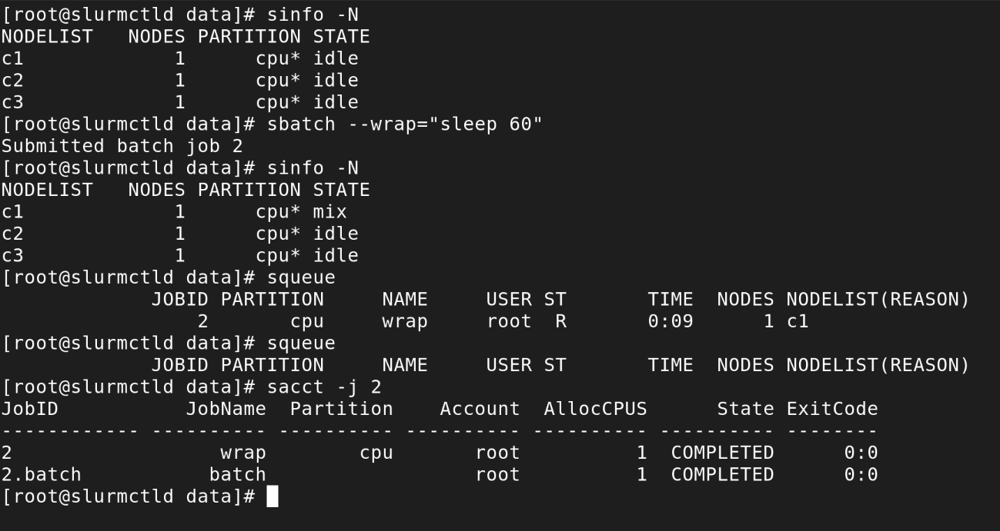

## What is Slurm

**Slurm**[^1] is a workload manager for compute clusters. When you have multiple machines and multiple users that need to submit large jobs to them, you need a system that will queue the tasks, decide what to run where (based on required RAM, CPU, GPU and other constraints). In large shared systems, it takes care of accounting how many compute hours are assigned to each user.

Sounds similar to Kubernetes? It is, but they are designed for slightly different tasks. Slurm is made for batch jobs that usually do number-crunching for a few hours or days and save result to files. It's the standard scheduler in academic and research HPC (High Performance Computing). K8s is made for long-running services. It scales the containers, monitors their health, routes traffic. In short, K8s can do Slurm's job (and sometimes it is used for HPC), but not vice versa.

## Why Slurm at home

Similar reason to everything in the Homelab section. I worked with Slurm before. I don't use it day to day any more, and skills you don't use have a way of quietly evaporating.

## Running a small cluster

Real Slurm clusters are made of dozens of powerful machines - which, obviously, I don't have at home. Fortunately, I don't need to run big jobs just to see how the cluster works. It's possible to run Slurm using Docker containers for nodes. One `docker compose up` gives you a controller node, an accounting database, and a preset number of compute nodes which you can then scale up and down. I used a popular [giovtorres/slurm-docker-cluster project](https://github.com/giovtorres/slurm-docker-cluster).

## Installing with Ansible

Same as everything else on my home servers, this went in as an Ansible role. A few of the more interesting parts:

The role clones the upstream repo at a pinned version, and generates the `.env` file that the `docker-compose.yml` reads its configuration from:

```yaml
- name: Clone slurm-docker-cluster repo
  ansible.builtin.git:
    repo: "{{ slurm_cluster_repo }}"
    dest: "{{ slurm_cluster_root }}"
    version: "{{ slurm_cluster_version }}"

- name: Deploy slurm-docker-cluster .env
  ansible.builtin.template:
    src: env.j2
    dest: "{{ slurm_cluster_root }}/.env"
    owner: "{{ create_user }}"
    group: "{{ create_user }}"
    mode: '0600'
```

The `.env` template exposes the settings I need - worker count, GPU support, database credentials - as role defaults. Just in case I want to overwrite the settings using Ansible vars.

```jinja
CPU_WORKER_COUNT={{ slurm_cluster_cpu_worker_count }}
GPU_ENABLE={{ slurm_cluster_gpu_enable | lower }}

GPU_WORKER_COUNT={{ slurm_cluster_gpu_worker_count }}

```

One problem I found on a first attempt to start the cluster: the healthcheck for the MariaDB container (used for Slurm's accounting data) gives up too quickly on a first-time init. Creating the database and user on my old CPU[^2] takes longer than the author expected. Rather than changing the compose file (which would get overwritten on the next clone), the role adds a `docker-compose.override.yml` that Docker Compose picks up automatically:

```jinja
services:
  mysql:
    healthcheck:
      test: ["CMD", "healthcheck.sh", "--connect", "--innodb_initialized"]
      interval: 10s
      timeout: 10s
      retries: {{ slurm_cluster_mysql_healthcheck_retries }}
      start_period: {{ slurm_cluster_mysql_healthcheck_start_period }}
```

I set it to 120s with 5 retries - plenty of time even on weak hardware.

## The wrapper script

I didn't set the containers to autostart. My home servers have limited resources and I don't want to run all my experimental projects at once. So the role's last step is a thin wrapper script, deployed to `/usr/local/bin`, that just forwards to the project's Makefile:

```bash
#!/bin/bash
set -euo pipefail
cd "{{ slurm_cluster_root }}"
exec make "$@"
```

Which turns into a simple command, e.g. `slurm-cluster up`. The possible parameters are:

- `up` - start the cluster
- `down` - stop without discarding the state
- `clean` - stop and delete the volumes - accounting database, job spool etc.
- `rebuild` - `clean`, then straight back `up`
- `shell` - exec a shell on the controller node
- `status` - show container status
- `logs` / `logs-slurmctld` / `logs-slurmdbd` - container logs, all of them or just one
- `jobs` - view the job queue, without needing a shell first
- `quick-test` / `run-examples` - submit a canned test job / a set of example jobs
- `scale-cpu-workers N=5` / `scale-gpu-workers N=2` - change the worker count
- `reload-slurm` - push a config reload without restarting the containers
- `update-slurm FILES="slurm.conf"` - copy updated config file(s) into the controller and reload
- `set-version VER=25.05.7` - switch the Slurm version and rebuild
- `build` / `build-all` - build the image(s) locally instead of pulling

## Cluster info

Slurm commands are only available inside the containers, so I need to run `slurm-cluster shell` first. When I worked with a real cluster, one command I used all the time was `sinfo`. Usually, `sinfo -lN` for detailed node information. The `STATE` column was important:

- `idle` - up, idle
- `alloc` - fully allocated to a job
- `mix` - partially allocated (some CPUs free, some in use)
- `down` - unusable
- `drain` - not accepting new jobs and idle, ready for maintenance
- `draining` - not accepting new jobs, but waiting for the current job to finish
- `unk` - starting

Plus a couple of suffixes worth recognising, although I haven't seen them on the test cluster: `*` (not responding) and `~` (powered down).

Outside of the container, `slurm-cluster status` gives combined output of `docker compose ps` and `sinfo`, good for a quick check.


## First test

Submitting a trivial single-node job that just does nothing for a minute is a simple `sbatch --wrap="sleep 60"`. A "distributed" version is also trivial: `sbatch -N3 --wrap="sleep 60"`. 

In both cases, I could see the jobs starting in `squeue` and `sacct -j 1`, cancel with `scancel -j 1` and watch nodes getting busy in `sinfo`. 



## Differences compared to a real cluster

Other than the obvious difference in CPU, RAM and isolation between the "nodes" - the cluster running on Docker doesn't have as many ways to fail. With a large enough cluster, you can expect regular problems: slurmd fails to start, node can't authenticate to the controller, clock gets out of sync, GPU is not visible. Most of the problems in my experience weren't really Slurm-specific, just regular sysadmin stuff such as low disk space or wrong file permissions. These things don't happen on my experimental cluster, unless I intentionally break something.

As seen from the perspective of the controller node, the small cluster actually looks very much like a real thing. I can create partitions, set resource limits, run GPU jobs.

[^1]: Initially, Simple Linux Utility for Resource Management. Now just Slurm, probably because it's not so simple anymore.

[^2]: I lied. Just a little bit. Slurm is running on Serenity now, but I actually used it before setting up the homelab machine. It used to run on my NAS. Probably the longer timeouts wouldn't be needed now, but they don't hurt either.
