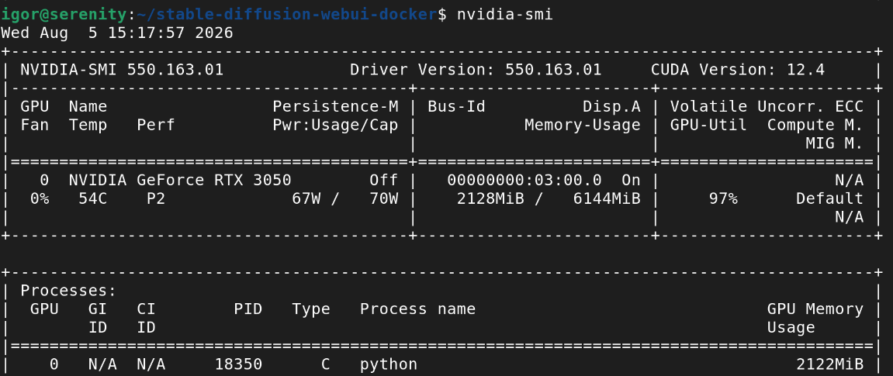
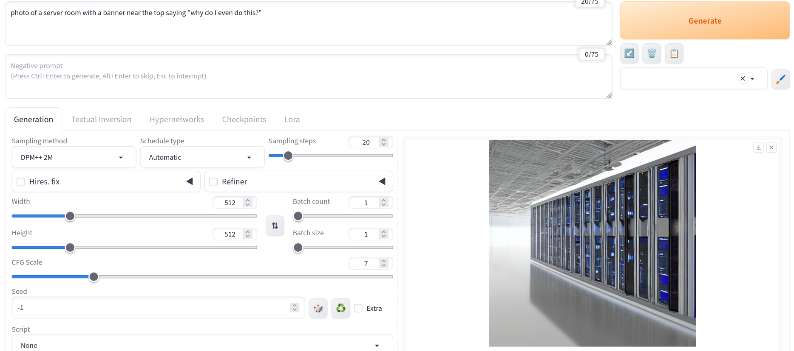
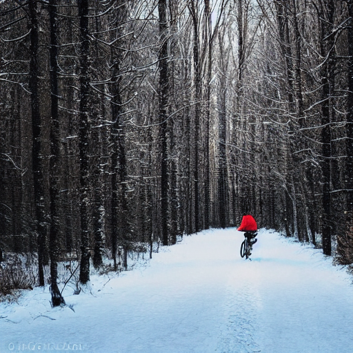
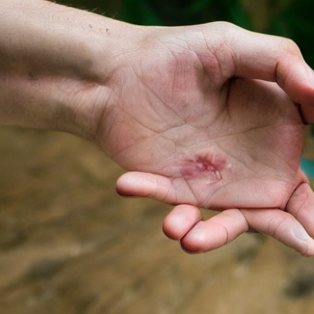
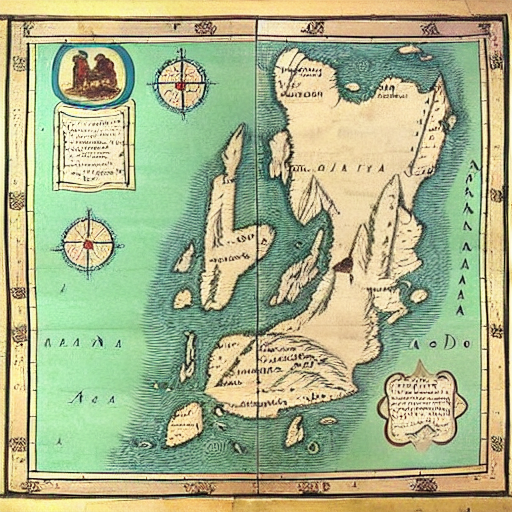
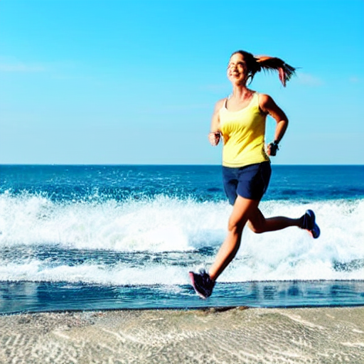
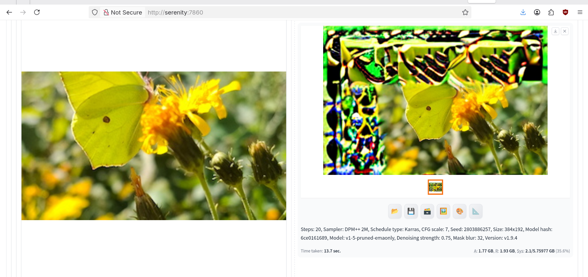

Personally, I think the world would be a better place without the flood of AI-generated images. But diffusion networks have other uses than generating fake photos, and the way they work is quite interesting. I should, at the very least, run a short experiment to see how they cope with hardware limitations.

## How diffusion networks differ from language models

I have some understanding of how LLMs work - both from a point of view of a user, and how they are built: words encoded as vectors, the attention mechanism, transformer layers. Diffusion networks, by contrast, seem more like magic to me.

Training a diffusion network takes a forward and backward process. Forward process is adding a small amount of Gaussian noise at each step, repeated hundreds or thousands of times, until it becomes pure random noise. So far everything's clear. Reverse process means training the network to undo the noising step by step, until an image - a new one - appears from the noise. Each step in the reverse process is guided by a conditioning signal - usually a text prompt encoded with a transformer, so the model aims toward an image described by the prompt.

## Software choice

[AUTOMATIC1111's stable-diffusion-webui](https://github.com/AUTOMATIC1111/stable-diffusion-webui) is the closest thing to Ollama + Open WebUI - a wrapper that runs everything in one convenient package. But it doesn't ship with an official Docker image. An unofficial one: [AbdBarho/stable-diffusion-webui-docker](https://github.com/AbdBarho/stable-diffusion-webui-docker) is good enough.

Another choice could be [ComfyUI](https://github.com/comfyanonymous/ComfyUI) - it's node-based and gives full control over every possible parameter. The right tool for someone building a specific pipeline rather than just playing.

### Installing

```bash
git clone https://github.com/AbdBarho/stable-diffusion-webui-docker
cd stable-diffusion-webui-docker
docker compose --profile auto up --build
```

First run downloads models and builds container images. Expect to wait at least a few minutes. In my case - on HDD and old CPUs - it took about half an hour. 

The *auto* profile works on a GPU. There's also an option to run the software on CPU only, if you're OK with waiting an hour to get your image. At the time of writing, the profile's build fails when attempting to clone *stable-diffusion-stability-ai* with: `fatal: could not read Username for 'https://github.com'`. That's because the upstream repository, *Stability-AI/stablediffusion*, has been taken down. See [issue #715](https://github.com/AbdBarho/stable-diffusion-webui-docker/issues/715) for the current state and workaround. It's a one line edit in Dockerfile to use a fork instead of the original source.

If all worked fine, point a browser to port 7860 of your computer.


### Dealing with limited hardware

Fitting the model into my 6GB is not the end of the problems. VRAM is also needed for the image. I can forget about high resolution, it's back to the 1980s: 512x512, the default size, worked reliably. Anything more than that risked stopping the generation after a few steps.

There are several settings to tune the software, but the defaults in docker-compose.yml are already optimal for low-end GPUs. Only change them if you have a powerful card with lots of VRAM.

- **`--medvram`** - keeps only the model component currently in use on the GPU, moving the rest to system RAM between steps. It's a difference between SDXL running slowly and SDXL not running at all.
- **`--xformers`** - enables memory-efficient attention, cutting VRAM use during generation with almost no quality cost. About as close to a free win as possible.
- **Precision** - fp16 by default, can be increased to fp32 for more precision at the cost of doubling VRAM usage.

As usual, `nvidia-smi` confirmed when the GPU was in use.



## Using Stable Diffusion

### Text-to-image

Unlike commercial apps such as DALL-E or Midjourney, many parameters are exposed for you to tinker with. You start with a prompt and an optional negative prompt (what to avoid - e.g. extra fingers). But there's more.

**Step count** is self-explanatory - how many steps of denoising do you want to do. More give a better result (but with diminishing returns) but obviously take more time.

**Sampling method** is the numerical solver used to denoise at each iteration. There's no universally "better" one. It's a tradeoff, not only speed vs quality, but also how much variety they introduce. For example, *DPM++ 2M Karras* tends to quickly converge towards the prompt, you need fewer steps. On the other hand, *Euler a* and *DPM++ 2M SDE* inject fresh randomness at every step, so the image keeps shifting even at high step counts. They sometimes give more interesting results but at a risk of introducing more weirdness.

**CFG scale** controls how hard the model is pushed towards the prompt. Low values (1-3) almost ignore the prompt, giving more random and often incoherent results; high values (12-20) force stricter prompt adherence but also oversaturate colours and introduce artefacts, giving the classic "AI image" look. 6-8 usually give the best result.



#### Comparing settings with X/Y/Z plot

Rather than changing one slider at a time and trying to remember what the previous image looked like, the built-in **X/Y/Z plot** script (under Scripts, at the bottom of the txt2img tab) generates an image with fixed prompt and seed but varying some parameters.

#### Results

Models usable on my card generate images that look a lot like those early examples you could find on the web. They work OK on generic landscapes, but really struggle with faces and writings. Newer models are specifically trained to make realistic hands, this one definitely isn't.







### Image-to-image: outpainting a photo

There are other modes than text-to-image. One of them is image-to-image. You can use it to turn a quick sketch into a proper drawing, or your photo into a manga picture (but then Hayao Miyazaki will be disappointed in you). That is, you could do that with more hardware, capable of running better models.

A more practical use is *inpainting* - replacing a small part of an image with something that should be there, based on the surroundings (a better version of healing tools available in all photo editors). Or *outpainting*, extending an image by guessing what's outside of the frame.

I picked a photo and tried extending it beyond its original borders with the **Outpainting mkII** script (img2img tab, Scripts dropdown). I chose to outpaint to the left and top, choosing one easy direction (just some blurry background) and one hard (I deliberately cropped part of the butterfly's wing).

First attempt crashed immediately and I found the following in Docker logs:

```bash
auto-1  |   File "/opt/conda/lib/python3.10/site-packages/PIL/Image.py", line 3173, in _decompression_bomb_check
auto-1  |     raise DecompressionBombError(msg)
auto-1  | PIL.Image.DecompressionBombError: Image size (184320000 pixels) exceeds limit of 178956970 pixels, could be decompression bomb DOS attack.
```

No, it's not a Denial of Service, it's just an image that's too large. I scaled it down even more. Second attempt worked, but the results were far from impressive. The extended area was filled with some kind of invented texture, nothing resembling the source image. Whether that's a limitation of a chosen model or the parameters, isn't clear from a single attempt, but I didn't feel like continuing.





## What have I learned

Not much, I'm afraid. Unlike LLMs, where choosing a smaller/larger model and different quantisation level had immediate effects on output quality, diffusion models remain unpredictable to me. Possibly, I could develop some intuition after playing around more, but waiting a minute to get another ugly image seemed like a waste of time and energy.

Probably the most important experience was a side effect of a slow hardware (and an app that exposes its inner workings). I could see the generating-by-denoising in action. The image started with a pure noise, after a few steps some shapes appeared, few steps later they changed into a blurry image and gained sharpness with each subsequent step.
