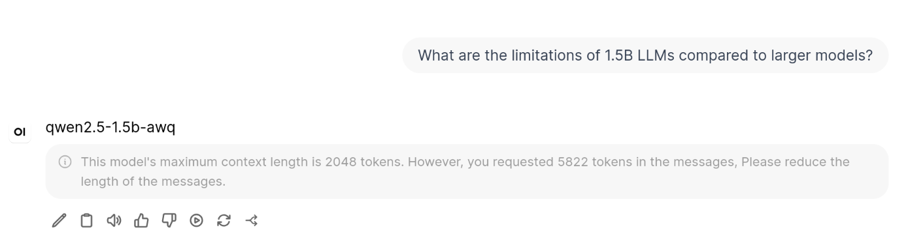
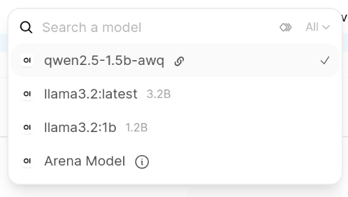
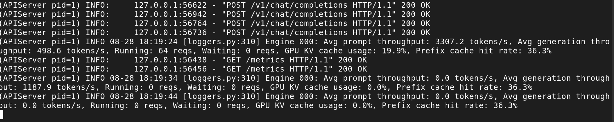
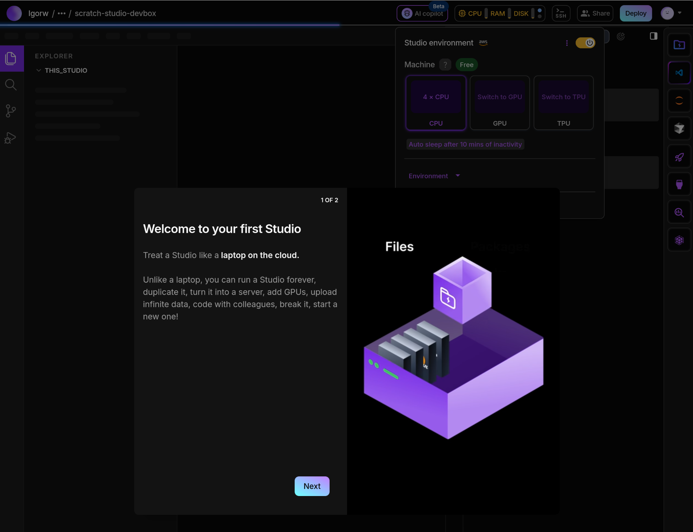
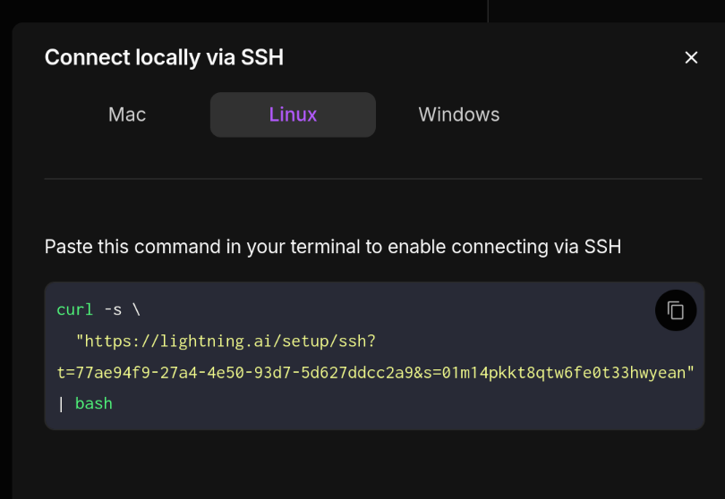
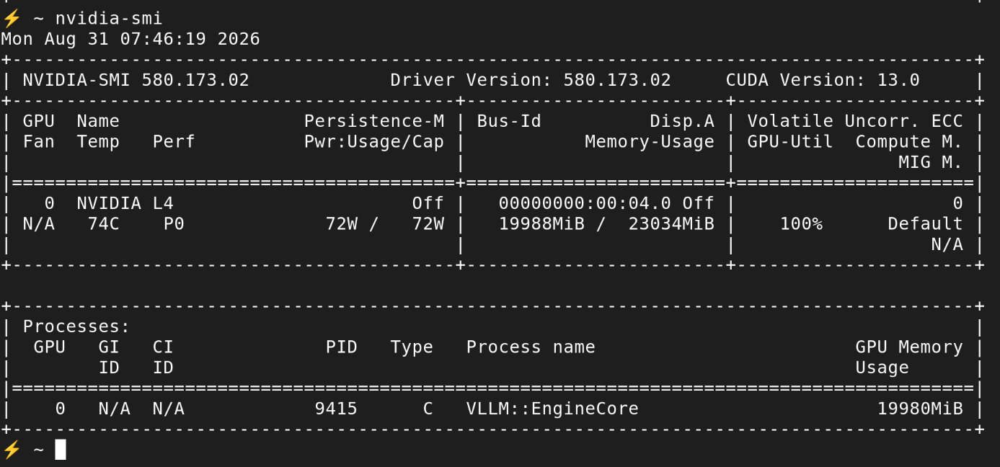
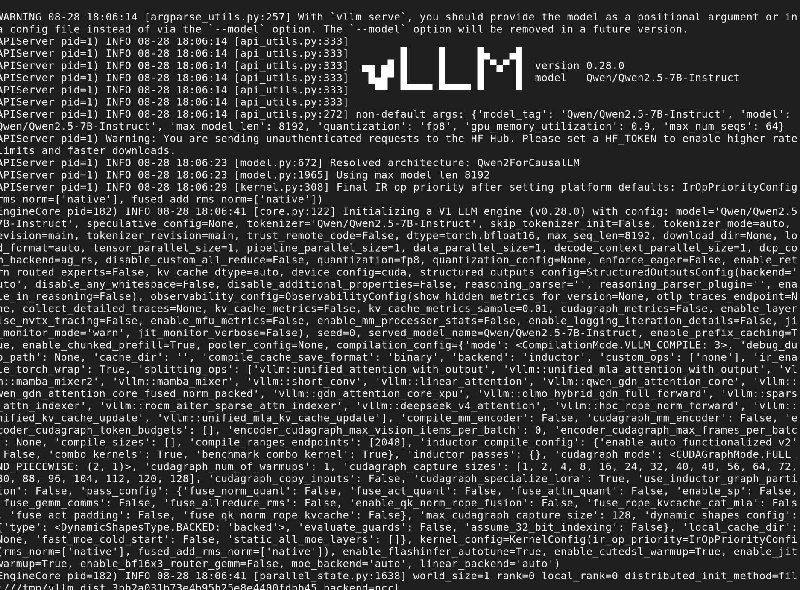
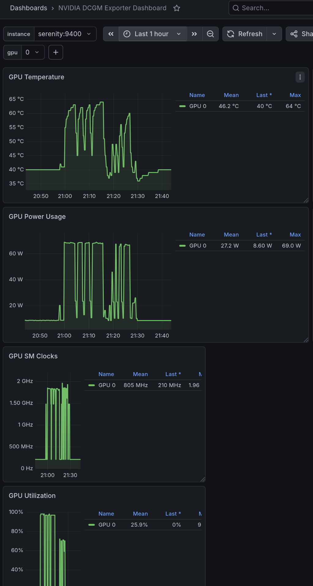

My first local LLM experiments were done with [Ollama](/homelab/ollama-openwebui/). It's great for getting started quickly. Just a handful of commands, automatic CPU offloading, few configuration options - hard to go simpler than that. It works fine for experiments, but if you try to use it for real workloads, limitations will start to show up. And the biggest one is: Ollama doesn't scale well. Historically, it could only answer one request at a time. Since May 2024 it supports concurrency, but supposedly it's not great at it. That's what I'm going to test.

The most popular choice for companies running local inference is **vLLM**. It's equally easy to install and slightly harder to use than Ollama. It works on pretty much everything you might want to run your AI workloads on: NVIDIA and AMD GPUs, x86 and ARM CPUs, specialised tensor processing hardware. It's compatible with different model architectures. It exposes an OpenAI-compatible API and a few others.

## Software choices

vLLM isn't the only engine. It's the most popular because of its wide compatibility, ease of use and very good (but not the best) performance. Next in popularity are two others, with better performance in their respective niches.

**SGLang** solves a narrower problem: when many requests share a common prefix (e.g. the same system prompt in a chatbot or agents replaying the same context), **RadixAttention** caches that shared prefix and reuses it across requests, instead of recomputing it every time. For that kind of workload it's noticeably faster than vLLM. If the requests are independent, it's more or less the same speed, but wastes VRAM on the unneeded mechanism. Other than the VRAM requirement, it's a reasonable alternative for home experiments: friendly licence, easy to install with pip/uv or docker, supports a similarly wide range of hardware, speaks the same OpenAI-compatible API.

**TensorRT-LLM** works differently. Instead of loading a model, you compile it first. The result is code tuned to a specific GPU. The engine was created by NVIDIA and obviously only works on their GPUs, but it can squeeze the most performance out of them. But the performance comes with a price: not only in hardware compatibility, but also the compilation step takes between a few minutes and an hour. That's completely fine if your business case is to run the same model for weeks, but if you're experimenting and changing parameters, all the performance gains will be eaten up by compilation time.

| | vLLM | SGLang | TensorRT-LLM |
|---|---|---|---|
| Core idea | PagedAttention + continuous batching | RadixAttention (prefix-tree caching/reuse) | Ahead-of-time compilation |
| Best at | General-purpose concurrent serving | Shared-prefix traffic (chat, RAG, agents) | Peak performance on one fixed setup |
| Hardware | wide support | wide support | NVIDIA GPUs only |
| Changing models | Fast | Fast | Slow - compile first |
| API | OpenAI-compatible | OpenAI-compatible | Typically fronted by Triton/NIM for an OpenAI-style API |
| Licence | Apache 2.0 | Apache 2.0 | Apache 2.0 |

So, tl;dr version - vLLM is the default choice, SGLang for shared context, TensorRT-LLM if the model rarely changes.

## How vLLM works

The biggest difference between vLLM and llama.cpp derivatives (and one that makes it better suited to serve many simultaneous requests) is **PagedAttention**. Every request to an LLM needs a KV cache - working memory for the tokens generated so far - and that cache grows as the conversation grows. The naive approach reserves a big contiguous block of VRAM per request, sized for the worst case. If you want to serve 10s or 100s of requests, it wastes a lot of VRAM when most conversations are shorter than the worst case. PagedAttention borrows the idea of OS virtual memory paging: the KV cache is split into fixed-size blocks that get allocated and freed on demand. Many requests can share the GPU's memory without reserving space they don't need.

On top of that, vLLM does **continuous batching**. The scheduler mixes tokens from many different requests into the same batch on every GPU step, adding new requests and evicting finished ones. The GPU spends its cycles on useful work instead of waiting.

vLLM also does **ahead-of-time CUDA graph compilation** at startup. Which means it runs the model's forward pass with different parameters and caches the CUDA kernels. This way, they're ready when it serves requests later. The step is CPU bound, so without cached kernels a fast GPU would wastes cycle waiting for the CPU. The cost of this mechanism: longer startup time and more VRAM usage.

The result: this is the engine actually used by AI startups and corporations needing self-hosted models for privacy or compliance.

### What that means for a homelab of one

None of this multi-user machinery is free. vLLM reserves a large share of GPU memory for its KV cache and CUDA graphs. There's also no equivalent of Ollama's easy offloading to system RAM - vLLM assumes the model fits on the GPU (technically offloading is possible, but awkward enough not to use it). In other words: on a single 6GB card serving exactly one person, vLLM is fighting its own design goals.

## Running with Docker

### Compatibility issues

vLLM ships an official Docker image. It's quite large (over 9GB) and on my hardware the initial run took a long time. And it failed to start.

Digging into error logs, I found this:

```
vllm-1  | (EngineCore pid=133) ERROR 08-25 16:34:21 [core.py:1349] RuntimeError: Unexpected error from cudaGetDeviceCount(). Did you run some cuda functions before calling NumCudaDevices() that might have already set an error? Error 804: forward compatibility was attempted on non supported HW
```

If you work with CUDA, you know that compatibility problems are common. That was one of them. I requested *vllm/vllm-openai:latest* and as it turned out, it's built with CUDA 13.0, which requires NVIDIA driver version 580 or newer. NVIDIA supports some forward compatibility, but only on datacentre-class cards.

Debian ships with version 550 which supports CUDA up to 12.4. I had two choices: upgrade the driver or run an older Docker image. Since updating the driver is more invasive, I tried the older image first.

### Running the image

Here's my Docker Compose file - you can also [download it here](docker-compose.yml).

```yaml
services:
  vllm:
    image: vllm/vllm-openai:v0.8.5
    restart: unless-stopped
    runtime: nvidia
    ipc: host
    ports:
      - "8000:8000"
    volumes:
      - hf-cache:/root/.cache/huggingface
    environment:
      - HUGGING_FACE_HUB_TOKEN=${HF_TOKEN}
    command:
      - --model=Qwen/Qwen2.5-1.5B-Instruct-AWQ
      - --served-model-name=qwen2.5-1.5b-awq
      - --quantization=awq
      - --gpu-memory-utilization=0.85
      - --max-model-len=8192
      - --max-num-seqs=4
      - --enable-auto-tool-choice
      - --tool-call-parser=hermes

volumes:
  hf-cache:
```

Parameters:

- `--served-model-name` renames the model, since the Hugging Face repo id has a `/` in it that causes problems for some clients.
- `--enable-auto-tool-choice` and `--tool-call-parser=hermes` turn on function/tool calling. That's needed for using vLLM for AI agents, which I'm going to test later.
- `ipc: host` changes Docker's method of Inter-Process Communication. It's mostly recommended for multi-GPU setups. For one card, defaults probably would work as well, but it won't hurt either.
- `HUGGING_FACE_HUB_TOKEN` is only needed for gated models; the model I chose for the first test isn't one, but I kept it in the compose file since I might need it later. I don't even need to set the environment variable, Docker prints a warning but continues anyway.

### Configuration for small VRAM

The defaults are tuned for datacentre GPUs with plenty of VRAM, so running it on a gaming card meant changing a few parameters:

- **`--quantization awq`** - vLLM's AWQ kernels are the right choice on my GPU. FP8 weights would be better, but the RTX 3050's CC 8.6 doesn't support this format. I would need a CC 8.9 card.
- **`--gpu-memory-utilization`** - dropped from the 0.9 default to 0.85 - leaving only 900MB VRAM free (15% of 6GB) is already risky, with 600MB nothing is usable.
- **`--max-model-len`** - misleading name, as it sets the maximum context length. I initially set it even more cautiously at 2048, but it turned out too short for even the simplest questions.
- **`--max-num-seqs`** - A limit on concurrency; it doesn't need to be high to prove the batching works, and setting it too high uses more VRAM.
- **Model size** - 1-3B parameters at 4 bits. A 7B model that fits comfortably in Ollama would be too large here, because of vLLM's caches.



### Startup time

Getting from `docker compose up` to the engine that answers requests took about half an hour. I was prepared for a bit of a wait but that was even longer than I expected. I checked the container logs to see what took so long:

| Step | Time | Details | Bottleneck |
|---|---|---|---|
| Pulling the Docker image | ~27 min | vLLM's image bundles CUDA, PyTorch and other Python libraries - over 9GB. | Internet bandwidth (but see below) |
| Python startup | ~30s | Many large libraries to load. | CPU or disk - the old Xeons and HDD on Serenity. |
| Downloading the model from Hugging Face | ~2 min | The model file is about 1.1GB | Internet bandwidth |
| Loading weights into GPU memory | <1s | | |
| torch.compile  | 85s | vLLM compiles the model's forward pass into an optimised graph. | CPU |
| KV cache profiling | <1s | Works out how many tokens of KV cache fit in the remaining VRAM. | |
| CUDA graph capture | 37s | The graphs are cached in VRAM. | CPU |
| Route registration, server boot | <1s | FastAPI/uvicorn starts listening. | |

The first step seemed too slow for my 100Mbit connection at home. I suspected that Dockerhub throttles bandwidth for anonymous connections or my ISP doesn't deliver what it promises. But the explanation was simpler: I accidentally ran two concurrent pulls.

Luckily, the downloads only happen once. On the next start, both container image and model file were cached. But other slow steps, torch.compile and CUDA graph capture (~2 minutes) aren't so lucky - they are repeated on every startup.

## Using vLLM

### With Open WebUI

A small change in the Docker Compose file allowed it to connect to both Ollama and vLLM:

```udiff
  --- before
  +++ after
  @@ -21,15 +21,20 @@
         - "3000:8080"
       environment:
         - OLLAMA_BASE_URL=http://ollama:11434
  +      - OPENAI_API_BASE_URL=http://vllm:8000/v1
  +      - OPENAI_API_KEY=none
         - WEBUI_AUTH=false
       volumes:
         - open-webui:/app/backend/data
       networks:
         - ollama-net
  +      - vllm_default

   networks:
     ollama-net:
       name: ollama-net
  +  vllm_default:
  +    external: true

   volumes:
     ollama:
```



It worked more or less the same with both engines.

### A note on authentication

Given that vLLM is specifically designed for serving multiple concurrent users, one could reasonably expect a robust authentication mechanism with pluggable modules. One would be wrong. What you can do is add `--api-key <token>` (or the `VLLM_API_KEY` environment variable) to turn on Bearer-token auth. You can add multiple tokens, but every valid key looks identical to the server - there's no concept of user accounts.

```yaml
environment:
  - VLLM_API_KEY=${VLLM_API_KEY}
```

```python
client = OpenAI(base_url="http://localhost:8000/v1", api_key=os.environ["VLLM_API_KEY"])
```

On top of that, the key only guards requests under the `/v1`, `/v2`, and `/inference` path prefixes. [vLLM's own docs](https://docs.vllm.ai/en/stable/usage/security/) explain it clearly - *"do not rely on `--api-key` alone to secure vLLM"*. Other endpoints skip the check entirely: `/invocations` (a SageMaker-compatible route) offers the same inference capability as `/v1`, and utility/operational endpoints are open to anyone who can reach the port.

The recommended workaround is a reverse proxy in front of vLLM to handle authentication, DDoS protection and TLS termination, and expose only the paths meant to be public. I didn't bother for a homelab; for production use it's likely necessary.

### Talking to it from Python

So far I used Open WebUI or queried the REST API with curl. This time I wanted to try something else. This engine, just like Ollama, exposes an OpenAI-compatible web API, and the *openai* Python package works with it without issues. All you need to do is point it at a local server instead of the original one. The library needs the *api_key* parameter to be set, even if you didn't configure vLLM to require it. Just use any non-empty string here.

```python
client = OpenAI(
    base_url="http://localhost:8000/v1",
    api_key="not-needed",
)
```

[Full script](vllm_client.py) - it runs a few functions to do a quick test:

- **`list_models()`** - hits `/v1/models`, confirms what's currently loaded.
- **`chat_once()`** - an ordinary, non-streaming chat completion.
- **`chat_streaming()`** - the same call with `stream=True`, printing tokens as they arrive instead of waiting for the full reply.
- **`concurrent_requests()`** - fires several requests at once through a thread pool.

That last one is the interesting part. The first three behaved identically against Ollama, the fourth one tests continuous batching - several independent conversations at the same time, sharing the GPU's attention. Although if you want a real test, vLLM provides a better tool, `vllm bench serve`.



## Running vLLM on a bigger GPU

### Renting vs buying

In the GPU buying guide I described my approach: to own a budget GPU to experiment without worrying about costs, and run a more capable cloud VM for a short time when I need more power. That was the case: to see the multi-user behaviour, you're gonna need a bigger ~~boat~~ card.

Given the current hardware prices and high demand for GPU computing, it's no surprise that GPU-equipped VMs are much more expensive than CPU-only servers. A dollar per hour is a good approximation (could be half, could be two, depending on the provider and the exact model). That might not sound like much, until you realise it's over $700 per month. Some providers give free credits to new users, but they won't last long. Be quick and turn the VM off as soon as you're done. Many hobbyists and companies forgot about a VM or two and only discovered the mistake when they got the invoice.

GPU machines are available from all the usual cloud providers, and also from smaller companies specialising in ML solutions. I chose **[Lightning AI](https://lightning.ai/)** which gives enough free credits[^1] to new accounts to last for a few experiments (it's a standard link, I'm not getting anything). It's mostly suited for running web tools (Jupyter Notebooks, VS Code and some custom GUIs), but you can enable SSH access.





[^1]: The conditions keep changing. You might get a number of initial credits, recurring monthly credits, or both.

### Choosing a GPU

They have several GPUs to choose from, bigger ones cost more or burn free credits faster. I picked an **L4**, a good compromise between price and capabilities (24GB VRAM, CC 8.9 so it supports FP8). The cheaper **T4** was tempting - it has 16GB instead of 24GB which could be enough and it's half the price. But it's a 2018 Turing card: CC 7.5, even older than my home hardware. I wanted to test with FP8.



### Running vLLM

A VM comes with NVIDIA driver and Docker toolkit already installed. Running the software is almost the same as at home. Except it's better connected and uses faster hardware, so it starts in a few minutes instead of 30.



```bash
docker run --runtime nvidia --gpus all \
  --ipc=host \
  -p 8000:8000 \
  -v ~/.cache/huggingface:/root/.cache/huggingface \
  --name vllm \
  vllm/vllm-openai:latest \
  --model Qwen/Qwen2.5-7B-Instruct \
  --quantization fp8 \
  --gpu-memory-utilization 0.90 \
  --max-model-len 8192 \
  --max-num-seqs 64
```

Differences from the homelab config:

- **A bigger model, because I can** - Let's test with something I would really use: Qwen/Qwen2.5-7B-Instruct, a 7B model instead of the tiny 1.5B build at home. It's Apache 2.0 licensed and downloads anonymously, so there's no need for HUGGING_FACE_HUB_TOKEN.
- **FP8 instead of AWQ** - this GPU supports FP8 which keeps more of the model's original precision than 4 bit weights. vLLM quantises the BF16 checkpoint to FP8 on load, so no separate pre-quantised repo is needed.
- **`--max-num-seqs 64`** - that's what I came for. Now that I have more VRAM, I can do a proper multi-user test.

## Benchmarks

### Procedure

The load generator is vLLM's own `vllm bench serve`. It comes with the vLLM container image, so there's nothing extra to install. It runs a batch of prompts at the server and reports aggregate throughput and per-request latency. 

I checked the same parameters against vLLM and Ollama, both at home and on the rented L4. I ran all the benchmarks twice, to make sure the results are not affected by some random flukes. I got similar numbers each time.

### The RTX 3050 at home

On Serenity, I used a small model with both engines - a 1.5B version of Qwen 2.5, quantised at 4 bits.

```bash
docker run --rm --network host --entrypoint vllm \
  vllm/vllm-openai:latest bench serve \
  --backend openai-chat \
  --base-url http://localhost:8000 --endpoint /v1/chat/completions \
  --model qwen2.5-1.5b-awq --tokenizer Qwen/Qwen2.5-1.5B-Instruct-AWQ \
  --dataset-name random --random-input-len 512 --random-output-len 256 \
  --ignore-eos --seed 42 \
  --num-prompts 32 --max-concurrency 4 --request-rate inf
```

Note that I used different versions, `vllm-openai:v0.8.5` to serve the model and `vllm-openai:latest` to run the benchmark. That's because an older version of `vllm bench serve` didn't support the `--backend openai-chat` parameter, and I wanted to test specifically this API.

The Ollama run is the same again, swapping the URL for `http://localhost:11434`, `--model qwen2.5:1.5b` and `--tokenizer Qwen/Qwen2.5-1.5B-Instruct`.

One extra step: Ollama had to be restarted with `OLLAMA_NUM_PARALLEL=8`. Left to itself it either uses a default of 4, or drops to 1 under memory pressure. On this box it used 4.

This is how many total tokens per second I was able to get.

| Concurrent requests | vLLM total tokens | tokens/request | Ollama total tokens | tokens/request |
|---|---|---|---|---|
| 1 | 15 | 15 | 63 | 63 |
| 2 | 30 | 15 | 80 | 40 |
| 4 | 59 | 15 | 92 | 23 |
| 8 | 59 |  7 | 132 | 17 |


Starting point is not the same. When serving one request, Ollama is over 4x faster. Maybe it's because I couldn't use the same quantisation - Ollama uses Q4 format, while on vLLM it's AWQ-INT4. Same size, but possibly not the same performance. But I didn't dig deeper into this. The trend is more interesting than raw numbers.

For 2 and 4 concurrent requests, vLLM scales linearly. It plateaus at 4, can't get any more from this hardware (at least not without tuning).

Ollama also scales and offers better performance on every step, but look at the scaling factor: from 8x more requests it only got 2x more tokens.



The Grafana DCGM dashboard shows how it looked on the hardware side. vLLM used about 5.5GB of VRAM the whole time, Ollama needed 4.2GB The 1.3GB difference is the KV cache and CUDA graph memory.

Power and temperature also show an interesting thing. Both engines peak at 70W (this card's max) and 60°C, but vLLM sits there most of the time, while Ollama only touches them for brief moments. That's because Ollama doesn't cache CUDA kernels ahead of time, so GPU waits idle.

### The rented L4

Now that was the real test on hardware that vLLM is supposed to run on. First, I had to get Ollama running in addition to vLLM, with the same model. As on Serenity, Ollama has to be started with `OLLAMA_NUM_PARALLEL` set - here to 64. By default it used a value of 1 on this hardware and didn't scale at all. I can't explain why, supposedly it should base it on available VRAM, yet on the big card it used a smaller value (it was running a larger model though).

```bash
docker run -d --gpus all -e OLLAMA_NUM_PARALLEL=64 -v ollama:/root/.ollama -p 11434:11434 --name ollama ollama/ollama
docker exec ollama ollama pull qwen2.5:7b
```

And then the test. Against vLLM:

```bash
docker exec vllm vllm bench serve \
  --backend openai-chat \
  --base-url http://localhost:8000 --endpoint /v1/chat/completions \
  --model Qwen/Qwen2.5-7B-Instruct \
  --dataset-name random --random-input-len 512 --random-output-len 256 \
  --ignore-eos --seed 42 \
  --num-prompts 256 --max-concurrency 32 --request-rate inf
```

And again I tried different values of `--max-concurrency`.

Then the identical benchmark, only the URL, model name and tokenizer change - `vllm bench serve` needs a real tokenizer to build the random prompts, and `qwen2.5:7b` isn't a Hugging Face repo id, so it's pointed at the upstream one:

```bash
docker run --rm --network host --entrypoint vllm \
  vllm/vllm-openai:latest bench serve \
  --backend openai-chat \
  --base-url http://localhost:11434 --endpoint /v1/chat/completions \
  --model qwen2.5:7b --tokenizer Qwen/Qwen2.5-7B-Instruct \
  --dataset-name random --random-input-len 512 --random-output-len 256 \
  --ignore-eos --seed 42 \
  --num-prompts 256 --max-concurrency 32 --request-rate inf
```

A caveat before the numbers. Again I wasn't able to use exactly the same quantization. vLLM is serving the FP8 (8-bit) weights; Ollama's `qwen2.5:7b` is the default Q4_K_M, roughly 4-bit - a faster, but less accurate model, so Ollama starts with an advantage in speed. On second thoughts, I could have chosen a model more carefully. But I have a feeling vLLM will win despite the unfair conditions.

Tokens per second, as concurrency climbs:

| Concurrent requests | vLLM total tokens | tokens/request | Ollama total tokens | tokens/request |
|---|---|---|---|---|
| 1 | 29 | 29 | 45 | 45|
| 8 | 209 | 26| 71 | 9 |
| 32 | 668 | 21 | 82 | 3 |
| 64 | 997 | 16 | 213 | 3 |

**Single request, no concurrency**, Ollama wins - 45 tok/s against 29, and 20ms per output token against 34ms. That was obvious: faster model, and no need to waste cycles on the unused batching scheduler.

**Concurrent requests tell the real story.** vLLM's aggregate throughput climbs cleanly - 29, 209, 668, 997 tok/s - while mean latency per output token only goes up from 34ms to 59ms. It doesn't scale linearly anymore, but much closer to it than Ollama. Which, at 8x more requests doesn't even double the output compared to 1x. At 32x barely scales at all compared to 8x.

Latency is an even bigger problem: mean time per output token goes from 20ms to over 200ms, and mean time to first token passes a second. A fixed pool of 64 slots in llama.cpp isn't the same thing as PagedAttention with continuous batching.


## What have I learned

- vLLM only shows its value over llama.cpp derivatives under enough concurrency. Even if you don't care about VRAM usage (and who doesn't?), skipping complex multi-user mechanisms makes Ollama perform better (probably, the playing ground wasn't exactly level). At scale, the numbers are reversed.
- I should have chosen models for benchmarks more carefully, as the ones I found weren't exactly the same on both engines (but they showed the trend anyway, and I was too lazy to look further).
- On my GPU, llama.cpp (and especially Ollama, with its simplified setup allowing rapid prototyping) can even be practical. It fits 7B models that have some real-world uses.
- Running vLLM on my small RTX is just an exercise, no practical purpose other than to learn. VRAM requirements forced me to use a tiny model.
- Concurrency doesn't come free. At home I can run a 7B model for 1-2 users. To serve 64 users, I had to use a £2500 card (vs a £150 one on Serenity).
- My idea of buying a budget GPU and renting a bigger one proved useful. I was able to prepare everything in advance, and the tests on the VM took well under an hour.
- Don't let Ollama choose `OLLAMA_NUM_PARALLEL` automatically, cause it makes poor choices. Set to 1 and save some VRAM if you don't need concurrency; 2, maybe 4 if you need a bit of it. Above that don't use Ollama.
- Conclusion: serving a model to 1-2 users and to a larger number is different enough to require different tools; there's no "one-size-fits-all" solution.