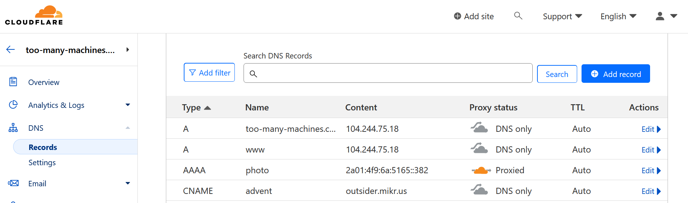
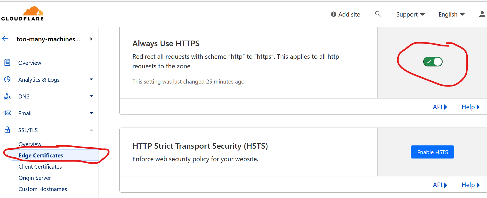

Some time ago I switched from dynamic Content Management Systems such as Wordpress to Pelican, a static website generator. Now I wanted to generate a photo gallery. I used to have one years ago but it's no longer available. Of course I post to social media, but I wanted a more permanent place. I also used to post my photos on TrekEarth, but this site is no more. I missed it, so I thought about publishing my travel photos first and having a map interface.

I quickly discovered that Pelican is not up to the task. I saw the limitations of this software already, mainly:

- the community is small, which means not much choice of themes and plugins (and possibly long time without updates), inadequate documentation
- it's hard to customise a theme (unless you're ready to fork it into a new theme).

So I decided to give a chance to another static generator, Hugo. I considered it before, I chose Pelican because it was written in Python (but I never touched the source code, so it's irrelevant) and I perceived it to be simpler to use (maybe, not sure about it now). And I'm satisfied with the experiment. I'm going to build my future websites with Hugo, probably one day I'll convert my existing sites too.

## Getting started with Hugo gallery

Installing Hugo on Debian is as simple as "apt install hugo". You can also download the binary from the project's website and place it somewhere in your path. I then looked at available themes (and chose one aptly named "Gallery"), created a repo on GitHub and initialized the site with:

```bash
hugo new site web-gallery --force # force required because the directory was not empty - it contained git files
cd web-gallery
git submodule add --depth=1 https://github.com/nicokaiser/hugo-theme-gallery.git themes/gallery
```

Now some configuration in __hugo.toml__. I copied it from the example website with obvious modifications:

```ini
baseURL = 'https://photo.too-many-machines.com/'
languageCode = 'en'
title = 'Photo'
theme = 'gallery'
copyright = "© Igor Wawrzyniak"
disableKinds = ["taxonomy", "term"]
defaultContentLanguage = "en"
enableRobotsTXT = true
timeZone = "Europe/London"


[params]
  title = "Photo"
  defaultTheme = "dark"

[author]
  name = "Igor Wawrzyniak"

[outputs]
  page = ["HTML"]
  home = ["HTML", "RSS"]
  section = ["HTML"]

[imaging]
  resampleFilter = "CatmullRom"
  quality = 75
  [imaging.exif]
	disableDate = false
	disableLatLong = true
	includeFields = "ImageDescription"

[module]
  [module.hugoVersion]
	extended = false
	min = "0.112.0"
```

## Adding content

Photos go into subdirectories of "content". I created directories for countries (Poland, UK, Ireland, Belgium...) then for cities or regions (Poland/Wroclaw, Poland/Bieszczady). Unless I only have few photos from the country and don't plan to add more soon, in which case I stopped at the country level. But, Hugo will ignore directories until I add an index file (which could be useful - I can add some photos, but if I'm not ready, just skip creating the index file).

There are two types of pages in Hugo, branch and leaf. Leaf is the end node - a post or article on a normal website, a gallery in this case. Branch contains a list of posts/articles/galleries. They use different template files, but from the user perspective the most important thing to remember is: for branch you need to create _index.md file, for leaf it's index.md without an underscore.

The only relevant part of the page is the front matter - the metadata section on a top. It can be written in several formats (YAML, TOML, JSON and ORG). Again, I followed the examples from the Gallery theme:

```yaml
---
title: Belfast
linktitle: Belfast
description: In 2005, when I lived in Dublin, I made a weekend trip to Belfast. It made a huge, if not always positive impression on me. Several years after the violence subsided, you could still see the marks it left. Barbwire everywhere, schools looked like prisons and police stations looked like fortresses. Murals praising terrorists from both sides - although some peaceful murals began to appear.

---
```

That's it, all my index pages look like this. Now I can type "hugo server" and click the local URL to test.


## Creating the map

Instead of a list, I wanted to have a zoomable, clickable map on the main page. Front end development is not my speciality, I didn't even know what software to use, so I asked ChatGPT. It told me to use Mapael library and generated HTML and JavaScript for me. The code was almost correct (imports didn't work and the HTML was missing one important div) but it was easy to fix. Now I needed to replace just one page in my generated website with my custom HTML. I had to learn a bit more than I intended about the way Hugo templates work, but it wasn't so bad and might come useful in future.


First thing to understand, all files from /themes/gallery/layouts can be overridden by files in /layouts - no need to replace the whole theme. Second, the main page by default uses the standard template for branch page. But, if a template for "home page" is present, it takes precedence. So, I created file /layouts/home.html.html (yes, double extension) and for the first attempt, I just put my crude HTML in there. It worked! Now, two things left to do: improve my map (set proper initial zoom, colours, add links to countries) and replace the manually created page with a proper template. The goal was to add extra imports in the head section (for mapael JavaScript files) and replace standard gallery list with my map, but keep the rest (menu, footer, CSS) for the consistent look.

I ended up creating several more files (everything's on my GitHub):

- I put all Mapael JavaScript files in /static
- in the same place I put map.js with my map configuration
- /layouts/partials/mapael_head.html contains all the code from the theme's /layouts/partials/site_head.html plus my extra JavaScript imports (not perfect, if the file changes in the theme I'll have to manually replace it, but the theme didn't provide any hook for custom imports)
- /layouts/home.html.html is based on the theme's /layouts/_default/baseof.html, but instead of importing site_head.html it imports mapael_head.html and instead of "block main" it has mapael divs.

In the end, I got a world map that's zoomed on Europe (if I travel somewhere further, I'll just have to zoom out), that automatically adjusts to the screen size, the countries with galleries are clickable and marked by a different colour than the rest.


## Publishing the website

Run "hugo" without any parameters then just copy all the files from /contents to your web server. That's it, no need to setup a DB or any interpreter.

Except my web server is a special case. I'm a happy user of mikr.us, a VPS aimed at learning and experimentation. What's so special about it?

- it's dirt cheap, a yearly subscription costs about as much as a monthly subscription of a standard VPS (of a few days of a cloud VM) - I'm paying 65 PLN, that's about 13 GBP / 15 EUR / 16 USD,
- obviously it has no proper SLA, but it works, about as reliably as more expensive services,
- it only has IPv6 address, you can access it on IPv4 with port redirections, or with a proxy if you want to use standard ports and your own domain - generally some bending over backwards is required, but it's supposed to be educational and you're learning something in the process, right?
- it also comes with some extra services for free, including an easy to setup shared hosting (with IPv4 and IPv6, custom domains, DBs, mail server, automatic SSL certificates) which works like a charm for static content (would even work for PHP) and that's where I keep the rest of my websites, except it only has 500MB of space and low bandwidth quota - good enough for all my other needs except for the photo gallery.

So, I installed nginx on my VPS and uploaded the site to /var/www/html. How do I make it accessible to the vast majority of people who don't use IPv6? Easy peasy with a free tier Cloudflare service:

- login to Cloudflare, choose "Add domain",
- next, login to the domain registrar (OVH in my case) and set the nameservers to those provided by Cloudflare (note, I had problems with DNSSEC, can't confirm it now but probably it would be easier to disable DNSSEC before the DNS change),
- Cloudflare will automatically fill some of the DNS zone, not everything though (zone transfer is disabled by default) - in my case I had proper records for the main domain + www + MX, but it was missing subdomains (advent, selfhosting...) so I added them manually,
- make sure proxy is disabled initially, the goal is to recreate the old configuration first - don't introduce too much modifications at the same time.

DNS change might take some time to propagate (minutes, hours, depending how you set the TTL). But if all went well, you won't notice any downtime, since old servers provide exactly the same information as new servers. Now, if you're sure the domain's DNS is now served by Cloudflare (check with host -t NS your-domain-name), here comes the best part: I added "photos.too-many-machines.com" AAAA record with IPv6 address of my VPS and this time turned the proxy option on. The magic happens in the background:

- I only declared AAAA record, but Cloudflare added both AAAA and A (IPv6 and IPv4),
- and they don't point to the address I provided, they point to one of Cloudflare servers,
- which will proxy the connection and connect to my VPS on IPv6 while serving clients on both protocols.



## Adding HTTPS

I could configure my Nginx to support TLS and get a free certificate from LetsEncrypt. But, my whole traffic is going through Cloudflare which can do TLS termination. Actually, it gets a LetsEncrypt certificate by default and the website is already available with HTTP and HTTPS! Only thing left to do is to turn on the option to "Always use HTTPS", so everyone trying to access a non-encrypted version is redirected.


