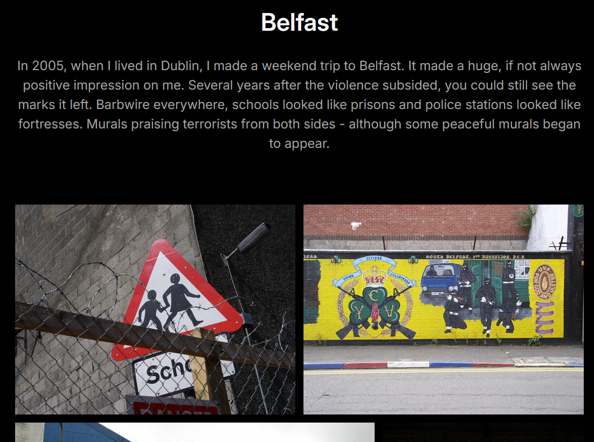
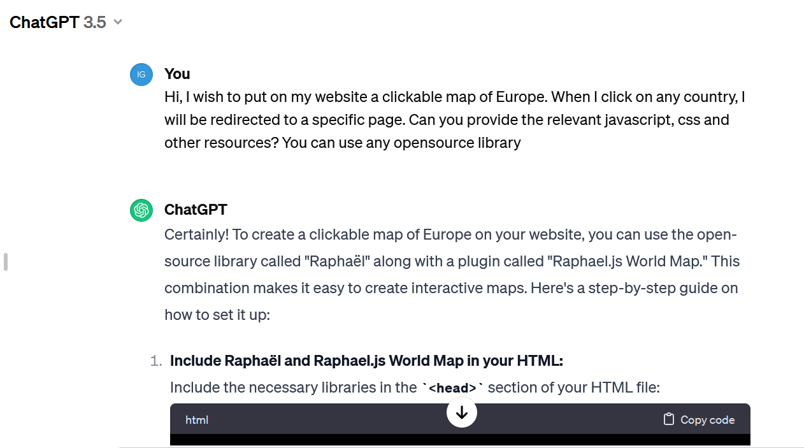
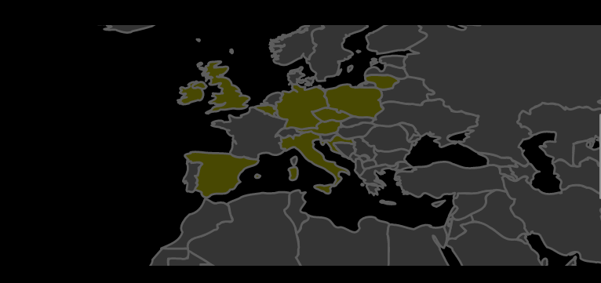

The photo gallery was my initial reason for switching from Pelican to Hugo. Pelican didn't have a good gallery theme. Plus, customising themes in Pelican was hard, and I had a specific goal in mind.

Years ago, I posted my photos on TrekEarth, but this site is no more. I missed it, so I thought about publishing my travel photos first and having a map interface. Of course, I wouldn't get the community this way, but you can't have everything.

So I decided to give a chance to another static generator, Hugo. I considered it before, I chose Pelican because it was written in Python (but I never touched the source code, so it's irrelevant) and I perceived it to be simpler to use (maybe, not sure about it now). 

## Getting started with Hugo Gallery

I looked at available themes and chose one aptly named "Gallery", created a repo on GitHub and initialised the site with:

```bash
hugo new site web-gallery --force # force required because the directory was not empty - it contained git files
cd web-gallery
git submodule add --depth=1 https://github.com/nicokaiser/hugo-theme-gallery.git themes/gallery
```

Now some configuration in __hugo.toml__. I copied it from the example website with obvious modifications:

```ini
baseURL = 'https://photo.too-many-machines.com/'
languageCode = 'en'
title = 'Photo'
theme = 'gallery'
copyright = "© Igor Wawrzyniak"
disableKinds = ["taxonomy", "term"]
defaultContentLanguage = "en"
enableRobotsTXT = true
timeZone = "Europe/London"


[params]
  title = "Photo"
  defaultTheme = "dark"

[author]
  name = "Igor Wawrzyniak"

[outputs]
  page = ["HTML"]
  home = ["HTML", "RSS"]
  section = ["HTML"]

[imaging]
  resampleFilter = "CatmullRom"
  quality = 75
  [imaging.exif]
	disableDate = false
	disableLatLong = true
	includeFields = "ImageDescription"

[module]
  [module.hugoVersion]
	extended = false
	min = "0.112.0"
```

## Adding content

Photos go into subdirectories of "content". I created directories for countries (Poland, UK, Ireland, Belgium...) then for cities or regions (Poland/Wroclaw, Poland/Bieszczady). Unless I only have a few photos from the country and don't plan to add more soon, in which case I stopped at the country level. But, Hugo will ignore directories until I add an index file (which could be useful - I can add some photos, but if I'm not ready, just skip creating the index file).

There are two types of pages in Hugo, branch and leaf. Leaf is the end node - a post or article on a normal website, a gallery in this case. Branch contains a list of posts/articles/galleries. They use different template files, but from the user perspective the most important thing to remember is: for branch you need to create an _index.md file, for leaf it's index.md without an underscore.

The only relevant part of the page is the front matter - the metadata section on top. It can be written in several formats (YAML, TOML, JSON and ORG). Again, I followed the examples from the Gallery theme:

```yaml
---
title: Belfast
linktitle: Belfast
description: In 2005, when I lived in Dublin, I made a weekend trip to Belfast. It made a huge, if not always positive impression on me. Several years after the violence subsided, you could still see the marks it left. Barbwire everywhere, schools looked like prisons and police stations looked like fortresses. Murals praising terrorists from both sides - although some peaceful murals began to appear.

---
```

That's it, all my index pages look like this. Now I can type "hugo server" and click the local URL to test.



## Creating the map

Instead of a list, I wanted to have a zoomable, clickable map on the main page. Front end development is not my speciality, I didn't even know what software to use, so I asked ChatGPT (today I would use Claude). It told me to use Mapael library and generated HTML and JavaScript for me. The code was almost correct (imports didn't work and the HTML was missing one important div) but it was easy to fix. Now I needed to replace just one page in my generated website with my custom HTML. I had to learn a bit more than I intended about the way Hugo templates work, but it wasn't so bad and might come in useful in future.



First thing to understand, all files from /themes/gallery/layouts can be overridden by files in /layouts - no need to replace the whole theme. Second, the main page by default uses the standard template for a branch page. But, if a template for "home page" is present, it takes precedence. So, I created a file /layouts/home.html.html (yes, double extension) and for the first attempt, I just put my crude HTML in there. It worked! Now, two things left to do: improve my map (set proper initial zoom, colours, add links to countries) and replace the manually created page with a proper template. The goal was to add extra imports in the head section (for mapael JavaScript files) and replace the standard gallery list with my map, but keep the rest (menu, footer, CSS) for the consistent look.

I ended up creating several more files (everything's on my GitHub):

- I put all Mapael JavaScript files in /static
- in the same place I put map.js with my map configuration
- /layouts/partials/mapael_head.html contains all the code from the theme's /layouts/partials/site_head.html plus my extra JavaScript imports (not perfect, if the file changes in the theme I'll have to manually replace it, but the theme didn't provide any hook for custom imports)
- /layouts/home.html.html is based on the theme's /layouts/_default/baseof.html, but instead of importing site_head.html it imports mapael_head.html and instead of "block main" it has mapael divs.

In the end, I got a world map that's zoomed on Europe (if I travel somewhere further, I'll just have to zoom out), that automatically adjusts to the screen size, the countries with galleries are clickable and marked by a different colour than the rest.


