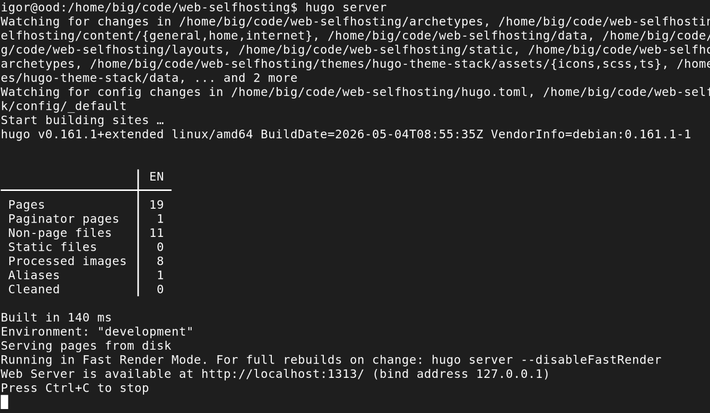

## Static Website Generator vs. Content Management System

If you're a dinosaur like me, you probably wrote your first websites manually, in HTML. In the 1990s and early 2000s, that was the default choice. Then came Content Management Systems, mostly based on PHP and MySQL: many competing systems first, until Wordpress dominated the market. Everyone shifted to them. 

I want to convince you to go back from server-generated pages. But it doesn't mean you need to edit HTML manually like it's 1998. Static website generators use a different concept:

- your content lives in plain text files (usually Markdown)
- after editing a post or adding a new one, you use the generator to "build" the site
- it will then combine your content with the theme (that decides how you site looks) and configuration
- and will output HTML, CSS and images, that you can upload to the server

The build and upload phase can be automated, if you prefer.

### Who is this guide for

I'm assuming you're familiar with CMSes. It's not really necessary, but I'm going to compare the two approaches. I'm also assuming you're not afraid to work with the terminal. But it doesn't mean you need to be an IT professional (though if you are one, everything here will be easy, if you're not, it might take some effort).

Static websites often go together with git. If you're familiar with it, I highly recommend to put your contents under version control. If you're not, you can skip this part, it's not required.

### Or let the AI do it

The first time I used Hugo, I did all the steps below manually. This time I used Claude. It turned out it could competently handle most of the steps above on its own: install the theme, change configs, rebuild, check the result, correct if needed. It worked especially well for migrating from Pelican to Hugo, since it required some boring steps: converting front matter and fixing image paths. I also used it to check for typos and other language errors (English is not my first language).

That doesn't mean you can skip reading this guide, though. Even if you don't run the commands, you need to understand the concepts. AI agents make mistakes and need pointing in the right direction.

### Advantages over CMS

- **Security** - Since there's no server-side processing, there are far fewer ways to attack your website.
- **Server availability and cost** - Again these come from no server-side processing: every web server can easily serve static pages. Which means you can use any cheap hosting provider and don't even need to check what features are available.
- **Speed** - On a CMS, the page is generated the moment someone accesses it, which takes time - could be a few seconds or more for a complex page on a busy server. Serving static files skips this step entirely.
- **Maintenance** - There's next to none. If you ever used WordPress, you know you need to constantly update your plugins and themes and it always introduces incompatibilities. With a static website generator, you can just continue using your setup as-is. (Fine print: you probably want to update the theme and the generator itself occasionally to get new features, but it rarely requires any changes to your config or content.)

### Ease of use?

CMS is easier to use, at least once someone set it up for you. Everything is from an admin panel on the web. Website generators have a steeper learning curve.

But they're only hard in the beginning. Once you've learned the concepts and configured it, adding more content is easy.

### Pelican vs. Hugo

I had used another website generator in the past - Pelican. In 2023 I wanted to build a photo gallery and discovered its limitations. There are few people maintaining the app and creating themes, the themes themselves are hard to customise. I used Hugo for my gallery and it worked perfectly. Next time I needed to create a site, I used Hugo too. I'm now in the process of migrating my old websites.

## Step by step guide

### Some new vocabulary

A handful of terms come up constantly:

- **Markdown**: a simple, text-only file format that offers some formatting: headings, bold/italic, tables etc. Used by many static website generators and a plethora of other apps.
- **Front matter**: a small block of metadata at the very top of a content file, between two lines of `---`. It's where you set things like the title, date, tags and whether the page is a draft.
- **Section**: content is grouped into sections, one per top-level directory under `content`. For example, everything under `content/internet/` belongs to the "internet" section.
- **Theme**: a separate package of layout and styling files that decides how your content looks, without touching the content itself. Swapping themes shouldn't require rewriting your posts.
- **Archetype**: a template used when you create a new page, so it starts with some sensible front matter already filled in.
- **Shortcode**: a small reusable snippet you can call from inside a Markdown file for things plain Markdown can't do on its own, such as embedding a video.
- **Page bundle**: probably the concept that trips up new Hugo users the most, so it gets its own section below.

### Installing Hugo and creating a site

I use Debian on my home laptop, so a simple `sudo apt install hugo` is enough to install. Other platforms have their own packages. Or you can download from the project's website - Hugo ships a single binary. Make sure you get the "extended" edition if your distribution offers a choice - some themes need it for SCSS support.

Once installed, creating a new site is one command:

```bash
hugo new site my-website
cd my-website
```

This generates a skeleton directory: `content` for your pages, `layouts` for any template overrides, `static` for files copied verbatim (favicons, robots.txt), `archetypes` for new-page templates, and a configuration file (`hugo.toml`, or `.yaml`/`.json` if you prefer).

## Choosing a theme

Browse the theme gallery on the Hugo website, then install your chosen one. There are several ways to do it, the recommended one is to use git submodule:

```bash
git submodule add https://github.com/some-author/some-theme themes/some-theme
```

Then point your configuration file at it:

```toml
theme = 'some-theme'
```

Most themes ship an `exampleSite` folder with a sample configuration - copying the relevant bits into your own `hugo.toml` will save you a lot of guessing about which parameters the theme actually reads.

## Configuring the site

At a minimum, your `hugo.toml` needs a `baseURL` (the production URL of your site), a `title`, and the `theme` name. This is where you also configure how your sidebar/top menu will look and hook up external systems (e.g. for comments). Here's how hugo.toml for this website begins:

```toml
baseURL = 'https://selfhosting.too-many-machines.com/'
locale = 'en'
title = 'Self Hosting'
theme = 'hugo-theme-stack'
summaryLength = 40
copyright = "© Igor Wawrzyniak"
defaultContentLanguage = "en"
enableRobotsTXT = true
timeZone = "Europe/Stockholm"
disableKinds = ["section", "taxonomy", "term"]
```

Most variables are theme-specific and live under `[params]`. The first time I created a Hugo website, I spent some time reading the docs, next time I simply copied the file and changed what was relevant.

## Page bundles: keeping content and images together

In many older static site setups (Pelican included), your Markdown files live in one directory and your images live in another, and you glue them together with a path like `{static}/images/photo.png`. Hugo encourages a tidier approach called a page bundle: a directory containing an `index.md` plus any images or other files that the page needs, all sitting next to each other.

```text
content/internet/hugo/
  index.md
  screenshot.png
```

Inside `index.md`, you reference the image with just its filename - `` - no need to know or care about the final URL. Hugo also uses this arrangement to automatically generate resized, responsive versions of your images at build time. This kind of bundle (one page, no children) is called a "leaf bundle". A "branch bundle" is the same idea but for a section front page - a directory with an `_index.md` that can have further pages underneath it, such as a section listing page.

## Adding your first page

You can create a new page bundle by hand, or let Hugo scaffold it from an archetype:

```bash
hugo new content posts/my-first-post/index.md
```

This creates the file with front matter pre-filled from `archetypes/default.md`, defaulting to `draft: true` so it won't accidentally get published. Open it, write your content in Markdown below the front matter, drop any images into the same directory, and flip `draft` to `false` when you're ready to publish.

## Previewing and building

While writing, run the built-in development server, which rebuilds and refreshes your browser automatically as you save:

```bash
hugo server
```
The server will run at http://localhost:1313/



When you're happy with the result, generate the final static files with:

```bash
hugo --minify
```

This writes everything to the `public` directory by default, ready to be uploaded to any static hosting provider or web server.

You can automate building and uploading the website e.g. using a Continuous Deployment system, but that's a story for some other day.
