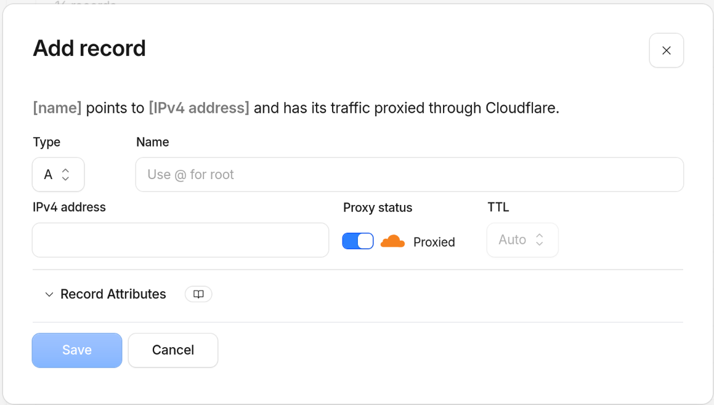
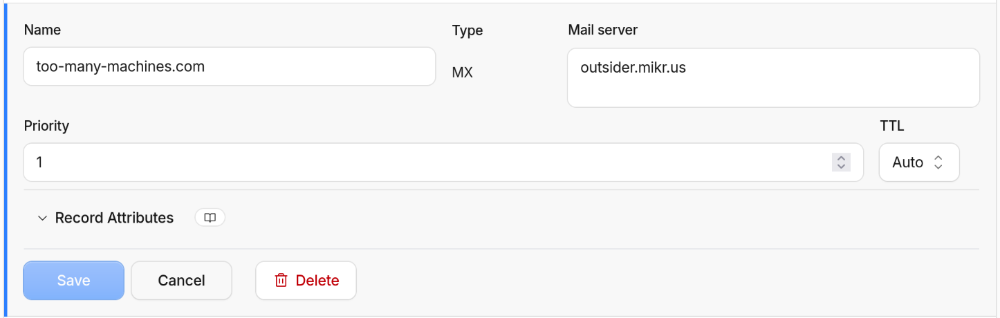

The [mikr.us post](/internet/mikrus/) mentioned that Outsider bundles a free mail server. But these days, if you just run the mail server without setting a few special **DNS records**, few servers will accept emails from it. And definitely not the big ones like Gmail and Outlook. We can all thank spammers for it.

## A note on record types

I'm assuming you're using some kind of admin panel for DNS (if you can edit zone files directly, I envy you). In most places, they default to **A** record when you add new entries. Make sure to choose the right type, **MX** for the first one, **TXT** for the other two.



## MX record: where mail is delivered

Other mail-related DNS records are a relatively new addition (early 2000s for SPF and DKIM, 2012 for DMARC), are intended to prevent spam and viruses and are still optional. MX has been with us since ancient times (1987), it's required and it has a different purpose: it tells the world which server accepts mail for your domain.

In my case, the mail server is outsider.mikr.us and priority can be anything. A domain can have multiple mail servers, in which case the priority field decides which one is main and which are fallback.



## SPF: saying who's allowed to send as you

SPF (Sender Policy Framework) is a TXT record listing the servers that are allowed to send mail claiming to be from your domain. Receiving mail servers check it. If a message claims to be from you but comes from a server not on the list, it can be flagged as suspicious (and likely classified as spam by the mail client) or rejected. Without an SPF record at all, there's no check - anyone can send mail pretending to be you@your-domain.

Outsider's panel shows the exact value to publish. For my VM, it looks like this: `v=spf1 a mx ip4:95.217.59.141 ip6:2a01:4f9:4a:1384:0:0:0:2 ~all`. Check with your own provider, you might need something else if you use mikrus, you definitely need something else if you use a different server.

Breaking that string down: `a` and `mx` allow the server(s) pointed to by your domain's A/AAAA and MX records to send mail, the explicit `ip4`/`ip6` add the VM's addresses directly, and `~all` means anything else, not from the list, should be soft-failed (recommends the receiving servers to treat the mail as suspicious but don't reject it). Soft-fail is a safer option while testing, when you're reasonably sure your setup is correct, change `~all` to `-all` which means hard-fail: ask the receivers to reject all mail that doesn't come from your servers.

Note: if you want to run your own mail server on the VPS and use this domain as the "from" address, don't forget to add its IP to SPF.

## Checking if it worked

Give DNS a few minutes to propagate, then check both records resolve:

```bash
dig +short MX your-domain.com
dig +short TXT your-domain.com
```

One thing to watch for: `dig` results can lag behind reality if your local resolver cached an earlier, empty answer. If a record you just added doesn't show up, try querying a public resolver directly (`dig @8.8.8.8 ...` or `dig @1.1.1.1 ...`) before assuming something's wrong.

You should see `outsider.mikr.us` for the MX query and several TXT records, one of them being `v=spf1 ...`. That's enough to get basic mail flowing with a minimal anti-spoofing check in place.

You can also use one of many services that check mail security. I don't have any preferred one, I just search for "check mail domain" whenever I need it. Or, if you use an AI agent such as Claude, you can ask it to check your domain and recommend further steps.

## DMARC: policy and reporting

DMARC builds on SPF (and DKIM, but I don't have it) by telling receiving servers what to do when a message fails those checks, and where to send reports about it. It's just another DNS TXT record, published at `_dmarc.your-domain.com`, so you can add it yourself regardless of what your mail provider supports.

Rather than setting up my own mailbox to receive the aggregate reports, I used Cloudflare's built-in "Email DMARC Management" feature, which generates the record for you and collects the reports on its own domain:

```
v=DMARC1; p=none; rua=mailto:c45b1153cbda491795b7b2f1c5d429f4@dmarc-reports.cloudflare.net
```

`p=none` means monitor-only for now - nothing gets rejected or quarantined because of DMARC, it just starts collecting data on who's sending mail as your domain and whether it's passing SPF. Once I've seen a few reports and I'm confident nothing legitimate is failing, I can tighten it to `quarantine` and then to `reject`.

## DKIM: the missing piece

DKIM (DomainKeys Identified Mail) works differently from SPF. Instead of listing which servers are allowed to send your mail, the sending server cryptographically signs each outgoing message with a private key, and adds a `DKIM-Signature` header to it. The public half of that key is published in DNS, as a TXT record at `selector._domainkey.your-domain.com` (the "selector" is just a name your mail provider picks, so it can rotate keys later). Receiving servers fetch that public key and verify the signature matches - which proves two things: the message really was sent by something holding your private key, and it wasn't altered in transit.

That second part is what SPF can't do. SPF only checks where a message came from; it says nothing about the message itself, and it breaks entirely when mail is forwarded through a third party (the forwarding server isn't in your SPF record, so the check fails even though the message is legitimate). A DKIM signature travels with the message itself, so it survives being forwarded and still verifies correctly at the final destination.

Unfortunately, there's no DKIM available for outsider.mikr.us, or at least I wasn't able to find it in the docs.

Consequences of not having it set up:

- **Forwarded mail is more likely to be rejected.** DMARC passes if either SPF or DKIM passes. If SPF ever fails (say, because a message got forwarded), the message fails DMARC entirely, with no fallback.
- **Slightly worse spam-filtering reputation.** Big providers (Gmail, Outlook) use DKIM as one more signal when scoring incoming mail. Having only SPF and DMARC isn't disqualifying, but it's one less thing working in your favour.
- **No tamper-evidence.** Without a signature, nothing proves the message body wasn't modified between leaving the sending server and arriving at the recipient's inbox.

None of that is catastrophic for a low-volume personal domain like mine - SPF plus DMARC already stops trivial spoofing, which was the main goal. But DKIM is the piece that would close the gap.