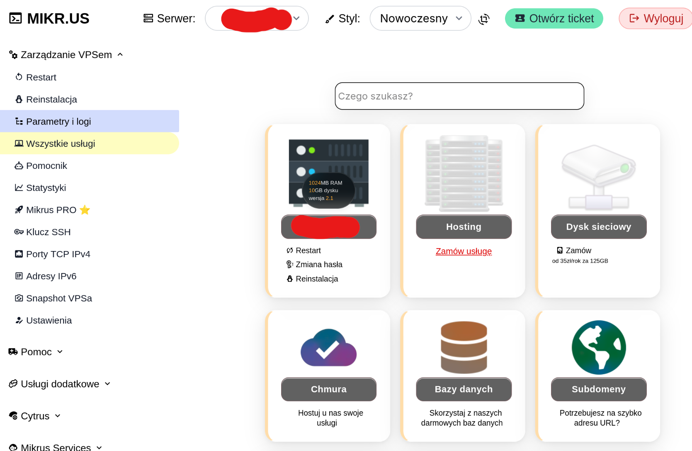
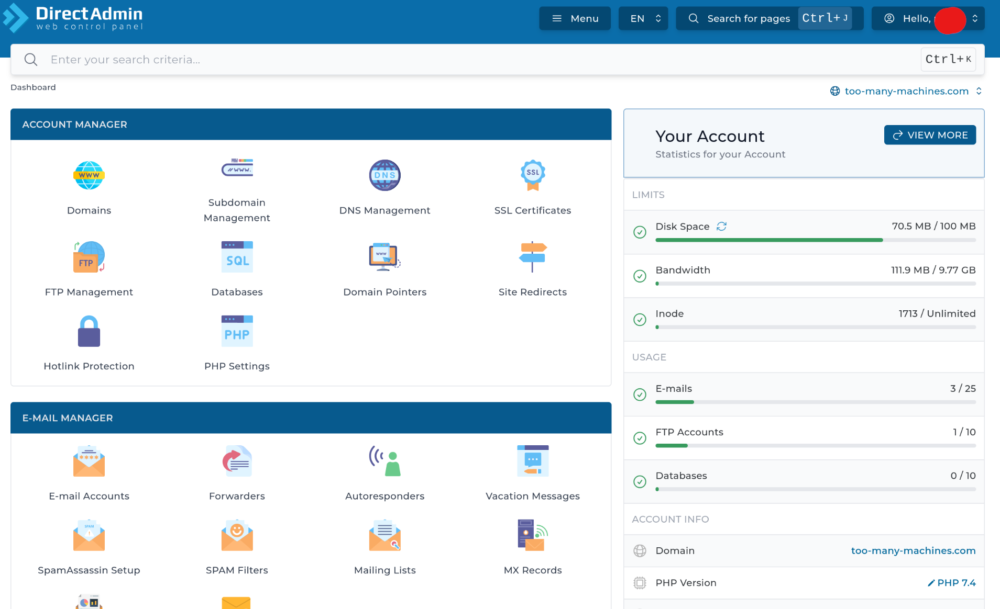

If you read the rest of this site, you probably noticed a clear split. Everything under "Self hosting at home" runs on my NAS and stays on the local network - no exposing it to the internet. That's on purpose. The services don't need to be reachable from the outside world. And every open port is one more thing that can be attacked.

But there are services that I want to live on the internet: this website, for example.
My photo gallery, some experimental apps. For that, you need a VPS: Virtual Private Server. A virtual machine which you can configure to your needs and easily recreate if you break something.

These days, many admins automatically think of AWS, Google Cloud Platform or Azure when they need a VM. They have nice features such as replication and auto-scaling. But, if you need exactly one VM running 100% of the time, traditional hosting providers are much cheaper.

## Why mikr.us

mikr.us is a Polish VPS provider aimed at learning and experimentation. It shows in two things: pricing and Service Level Agreement:

- A whole year costs about as much as a single month (sometimes just a few days) of a typical cloud VM. I pay 75 PLN a year, which is roughly 13 GBP / 15 EUR / 16 USD.
- For that price you obviously don't get an enterprise SLA. But in practice it has been about as reliable as the more expensive services I've used.

Note that you can run commercial services from it, if you like. I know that many companies use it, especially for testing or to run monitoring scripts.

There are also some quirks you have to accept:

- The server only has an IPv6 address. Reaching it over IPv4 needs port redirection (you automatically get one for SSH and can configure some more, all on high ports), or a proxy in front of it if you want standard ports and your own domain (which is easier than it sounds and explained in the next post).
- The resources are modest, this is not where you run anything resource-hungry.
- You can't run anything other than Linux and you can't choose the kernel - it is shared.
- Service agreement specifically prohibits several applications that put too much load (media streaming, some game servers), plus the usual illegal or grey-area activities.
- Support is community-driven rather than enterprise-grade.

None of that has been a real problem for me. It's meant to be a bit of a hands-on, DIY experience, and you end up learning something in the process - which is exactly what I wanted.

### Outsider

A useful feature of mikr.us is called Outsider. It's an extra service bundled in for free, and it gives you an easy, ready-to-go shared hosting setup: web server, PHP support, databases, mail server, automatic SSL certificates - all without touching your own server configuration.

It works like a charm for static content (and would work fine for small PHP apps too), and it's where I keep most of my websites. This one and a few other small pages. The real limits are 500MB of space and a fairly low bandwidth quota, which is more than enough for text and a reasonable number of images, but not for something like a photo gallery with hundreds of full-size photos. That's the one thing I run on the actual VPS instead, behind Cloudflare, exactly like I described in the [photo gallery post](/internet/gallery/).

### Other conveniences

There are loads of them, I haven't even used half.

- **Strych** (attic) is a backup solution where you can rsync files from your mikr.us VM
- **NOOBS** is a set of scripts for installing and configuring many popular applications
- A shared instance of **WireGuard** if you need a VPN but don't want to configure your own
- **Pusher** sends mail notification to the VPS owner
- **M.A.R.I.A.N** is a tool for diagnosing problems with the VPS
- **Amfetamina** is a temporary boost (more RAM and CPU) e.g. when compiling software
- Comes with a **free subdomain** but you can assign your own domains

### One inconvenience

The registration site is only in Polish, so is the documentation and the main VPS admin panel. These days, when all browsers can translate websites, it's not a deal breaker.

Outsider admin panel, where you'd probably spend more time, has multiple language versions. And if you reach out to the community (on Discord or Facebook) someone will surely answer in English.

## Getting started with mikr.us

Convinced already? Go to the [mikr.us website](https://mikr.us/?r=34eb52ab) (full disclosure: it's an affiliate link, if you use it I'll get 2 months free) and select the version you need. 

- **Frog** is an almost-free option - only a one-time payment of 5 PLN (that's about $1 or €1), but it's very limited
- **Mikrus 1.0** has only 384MB of RAM and can't run Docker - still, a good choice for a single-purpose machine, e.g. to run monitoring scripts.
- **Mikrus 2.1** is a sweet spot for me: 1GB of RAM and 10GB of disk space is enough for a Linux server. I used to run commercial services on less than that.
- If you need more, there are higher plans available, up to **Mikrus 4.2** with 16GB RAM and 160GB disk space.

Register, pay and in a moment you'll have your machine up and running. You'll get your initial password in the welcome mail and the admin panel will show the exact SSH command (you need to connect on a high port, not the usual 22).

What's next? It's a Linux server, you can do anything with it. I'll show some ideas in later posts. Remember to keep it updated and backed up.