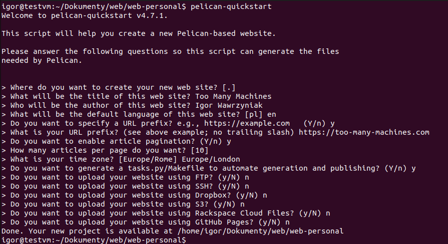
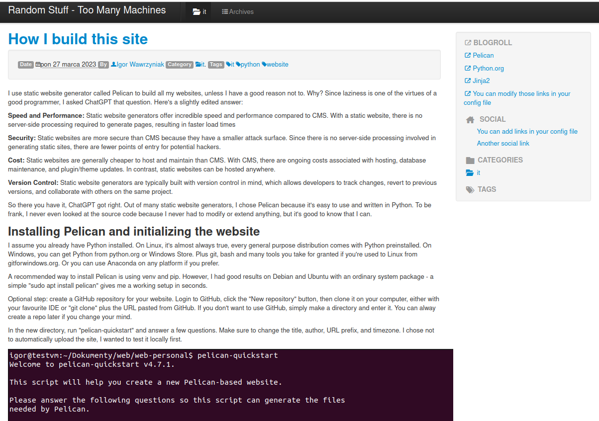

I use static website generator called Pelican to build all my websites, unless I have a good reason not to. Why? Since laziness is one of the virtues of a good programmer, I asked ChatGPT why a static website generator is better then a CMS. Here's a slightly edited answer:

**Speed and Performance:** Static website generators offer incredible speed and performance compared to CMS. With a static website, there is no server-side processing required to generate pages, resulting in faster load times

**Security:** Static websites are more secure than CMS because they have a smaller attack surface. Since there is no server-side processing involved in generating static sites, there are fewer points of entry for potential hackers. 

**Cost:** Static websites are generally cheaper to host and maintain than CMS. With CMS, there are ongoing costs associated with hosting, database maintenance, and plugin/theme updates. In contrast, static websites can be hosted anywhere.

**Version Control:** Static website generators are typically built with version control in mind, which allows developers to track changes, revert to previous versions, and collaborate with others on the same project.

So there you have it, ChatGPT got right. Out of many static website generators, I chose Pelican because it's easy to use and written in Python. To be frank, I never even looked at the source code because I never had to modify or extend anything, but it's good to know that I can.

## But I don't like the look of this website

Could be, but it's not the problem of Pelican. That's because I like minimalistic designs and I'm not very good at them. You can have as much eye candy as you like.

## Start simple

Static site generators can seem quite intimidating. You're faced with thousands of configuration options, plugins and themes. But you don't have to use all of these, definitely not from the start. My suggestion is to do some minimal configuration, add a bit of content, generate the website, repeat. For the developers: think of it as a one-person Scrum with 30 minutes sprint time.

## Installing Pelican and initializing the website

I assume you already have Python installed. On Linux, it's almost always true, every general purpose distribution comes with Python preinstalled. On Windows, you can get Python from python.org or Windows Store. Or you can use Anaconda on any platform if you prefer.

A recommended way to install Pelican is using venv and pip. However, I had good results on Debian and Ubuntu with an ordinary system package - a simple "sudo apt install pelican" gives me a working setup in seconds.

Optional step: create a GitHub repository for your website. Login to GitHub, click the "New repository" button, then clone it on your computer, either with your favourite IDE or "git clone" plus the URL pasted from GitHub. Remember to add *output/* to .gitignore. 

If you don't want to use GitHub, simply make a directory and enter it. You can alway create a repo later if you change your mind.

In the new directory, run "pelican-quickstart" and answer a few questions. Make sure to change the title, author, URL prefix, and timezone. I chose not to automatically upload the site, I wanted to test it locally first.



## Choosing a theme

Have a look at <https://github.com/getpelican/pelican-themes>. At first I chose Bootstrap2, a simple theme with no dependencies. Soon I discovered I should switch to similar looking, but much more powerful Pelican-Bootrstrap3 which requires several plugins. Fine, I'll need plugins anyway. Changing a theme is simple, so don't worry that you choose wrong.

Recommended way is to use git submodule to install the theme and plugins, but again I did it my way. Here's my setup:

- I keep all my websites in ~/Documents/web, eg. this one is ~/Documents/web/web-random
- In the same directory, I keep themes and plugins, in ~/Documents/web/pelican-themes and ~/Documents/web/pelican-plugins
- In each website's directory, I created symlinks to themes and plugins

```bash
cd ~/Documents/web
git clone --recursive https://github.com/getpelican/pelican-themes ./pelican-themes
git clone --recursive https://github.com/getpelican/pelican-plugins ./pelican-plugins
cd web-random
ln -s ../pelican-themes .
ln -s ../pelican-plugins .
```

Then I just added a few lines in configuration file pelicanconf.py:

```python
PLUGIN_PATHS = ['pelican-plugins']

THEME = 'pelican-themes/pelican-bootstrap3'
BOOTSTRAP_THEME = 'flatly'

JINJA_ENVIRONMENT = {'extensions': ['jinja2.ext.i18n']}
PLUGINS = ['i18n_subsites']
I18N_TEMPLATES_LANG = 'en'
```

## Adding content

Every file with .rst (ReStructuredText) or .md (Markdown) extension in the directory *content* will be parsed by Pelican. I prefer Markdown since it's also used on Github, Jupyter and many other places. Pelican considers every file an *article* - something that is indexed by a publication date, has category, tags etc. Unless the file is in the *content/pages* subdirectory - this one is for non-chronological content. So, if your website resembles a blog (like this one), you would have no or maybe several pages (eg. About) and many articles. If you don't want to see newest content first, you would put everything in pages.

Every article or page starts with a short metadata section. Here is an example taken from this post:

```yaml
Title: How I build this site
Date: 2023-03-27 17:30
Status: published
Category: it
Tags: it, python, website
Slug: pelican
```

Most of this is self explanatory. *Slug* is the output filename if you want to use a non-default. 

For the non-blog site, you generally skip things like tags and category. You also have to choose one page as the default. Example from my personal site:

```yaml
Title: Too Many Machines
Date: 2023-03-27 17:30
Status: published
Summary: Personal website of Igor Wawrzyniak
URL:
save_as: index.html
```

Then, after at least one empty line, follows the contents. You can use all of the standard Markdown syntax plus many extensions eg. from Github, such as syntax highlighting.

## Previewing the site

After adding some test content, I run two simple commands: make html && make serve

```bash
igor@testvm:~/Dokumenty/web/web-random$ make html && make serve
"pelican" "/home/igor/Dokumenty/web/web-random/content" -o "/home/igor/Dokumenty/web/web-random/output" -s "/home/igor/Dokumenty/web/web-random/pelicanconf.py" 
[15:37:32] WARNING  Watched path does not exist: /home/igor/Dokumenty/web/web-random/content/images                                                                                               log.py:91
Done: Processed 1 article, 0 drafts, 0 hidden articles, 0 pages, 0 hidden pages and 0 draft pages in 0.56 seconds.
"pelican" -l "/home/igor/Dokumenty/web/web-random/content" -o "/home/igor/Dokumenty/web/web-random/output" -s "/home/igor/Dokumenty/web/web-random/pelicanconf.py" 
Serving site at: http://127.0.0.1:8000 - Tap CTRL-C to stop
                       
```

So far so good. I've got the working website and it doesn't look very ugly. Articles are indexed by tags, category and date.



## Linking

There is already an image on this page and I didn't explain how to add them. Pelican has a concept of static files - they are copied to output directory without any change. You can configure different types of static files, images are already configured by default. Simply copy the files you need into content/images and use them like this:

```markdown

```

